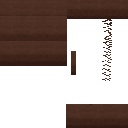

# 🏰 Bienvenue sur le Wiki Sandcraft

> [!TIP]
> Utilisez la barre de recherche GitHub en haut à gauche pour trouver un item précis.

# 🌐 Sandcraft - Encyclopédie des Mods

Cliquez sur une lettre pour accéder rapidement aux mods correspondants.

### [**A**](#a) | [**B**](#b) | [**C**](#c) | [**D**](#d) | [**E**](#e) | [**F**](#f) | [**G**](#g) | [**H**](#h) | [**I**](#i) | [**J**](#j) | [**K**](#k) | [**L**](#l) | [**M**](#m) | [**N**](#n) | [**O**](#o) | [**P**](#p) | [**Q**](#q) | [**R**](#r) | [**S**](#s) | [**T**](#t) | [**U**](#u) | [**V**](#v) | [**W**](#w) | [**X**](#x) | [**Y**](#y) | [**Z**](#z)

---

| Icône | Nom du Mod | Lien Direct |
| :---: | :--- | :--- |
|  | **Abnormals** | [Ouvrir la fiche](./wiki/recettes/abnormals.md) |
|  | **Ad** | [Ouvrir la fiche](./wiki/recettes/ad.md) |
|  | **Ae2** | [Ouvrir la fiche](./wiki/recettes/ae2.md) |
|  | **Ae2Things** | [Ouvrir la fiche](./wiki/recettes/ae2things.md) |
|  | **Aeinfinitybooster** | [Ouvrir la fiche](./wiki/recettes/aeinfinitybooster.md) |
|  | **Alexsdelight** | [Ouvrir la fiche](./wiki/recettes/alexsdelight.md) |
|  | **Alexsmobs** | [Ouvrir la fiche](./wiki/recettes/alexsmobs.md) |
|  | **Another** | [Ouvrir la fiche](./wiki/recettes/another.md) |
|  | **Appliedcooking** | [Ouvrir la fiche](./wiki/recettes/appliedcooking.md) |
|  | **Aquaculture** | [Ouvrir la fiche](./wiki/recettes/aquaculture.md) |
|  | **Aquamirae** | [Ouvrir la fiche](./wiki/recettes/aquamirae.md) |
|  | **Ars** | [Ouvrir la fiche](./wiki/recettes/ars.md) |
|  | **Arseng** | [Ouvrir la fiche](./wiki/recettes/arseng.md) |
|  | **Arsomega** | [Ouvrir la fiche](./wiki/recettes/arsomega.md) |
|  | **Atmospheric** | [Ouvrir la fiche](./wiki/recettes/atmospheric.md) |
|  | **Automobility** | [Ouvrir la fiche](./wiki/recettes/automobility.md) |
|  | **Bambooeverything** | [Ouvrir la fiche](./wiki/recettes/bambooeverything.md) |
|  | **Betteranimalsplus** | [Ouvrir la fiche](./wiki/recettes/betteranimalsplus.md) |
| 📦 | **Biomemakeover** | [Ouvrir la fiche](./wiki/recettes/biomemakeover.md) |
|  | **Biomesoplenty** | [Ouvrir la fiche](./wiki/recettes/biomesoplenty.md) |
|  | **Botania** | [Ouvrir la fiche](./wiki/recettes/botania.md) |
| 📦 | **Botany** | [Ouvrir la fiche](./wiki/recettes/botany.md) |
|  | **Botanypots** | [Ouvrir la fiche](./wiki/recettes/botanypots.md) |
|  | **Brewinandchewin** | [Ouvrir la fiche](./wiki/recettes/brewinandchewin.md) |
|  | **Buildersaddition** | [Ouvrir la fiche](./wiki/recettes/buildersaddition.md) |
|  | **Byg** | [Ouvrir la fiche](./wiki/recettes/byg.md) |
|  | **Car** | [Ouvrir la fiche](./wiki/recettes/car.md) |
|  | **Cataclysm** | [Ouvrir la fiche](./wiki/recettes/cataclysm.md) |
|  | **Cfm** | [Ouvrir la fiche](./wiki/recettes/cfm.md) |
|  | **Chimes** | [Ouvrir la fiche](./wiki/recettes/chimes.md) |
|  | **Cnb** | [Ouvrir la fiche](./wiki/recettes/cnb.md) |
|  | **Cofh** | [Ouvrir la fiche](./wiki/recettes/cofh.md) |
|  | **Comforts** | [Ouvrir la fiche](./wiki/recettes/comforts.md) |
|  | **Computercraft** | [Ouvrir la fiche](./wiki/recettes/computercraft.md) |
|  | **Cookingforblockheads** | [Ouvrir la fiche](./wiki/recettes/cookingforblockheads.md) |
| 📦 | **Corail** | [Ouvrir la fiche](./wiki/recettes/corail.md) |
|  | **Coralreef** | [Ouvrir la fiche](./wiki/recettes/coralreef.md) |
| 📦 | **Craftablehorsearmour** | [Ouvrir la fiche](./wiki/recettes/craftablehorsearmour.md) |
|  | **Create** | [Ouvrir la fiche](./wiki/recettes/create.md) |
|  | **Createaddition** | [Ouvrir la fiche](./wiki/recettes/createaddition.md) |
|  | **Createbigcannons** | [Ouvrir la fiche](./wiki/recettes/createbigcannons.md) |
|  | **Croptopia** | [Ouvrir la fiche](./wiki/recettes/croptopia.md) |
|  | **Cuisinedelight** | [Ouvrir la fiche](./wiki/recettes/cuisinedelight.md) |
|  | **Culturaldelights** | [Ouvrir la fiche](./wiki/recettes/culturaldelights.md) |
|  | **Cyclic** | [Ouvrir la fiche](./wiki/recettes/cyclic.md) |
|  | **Decorative** | [Ouvrir la fiche](./wiki/recettes/decorative.md) |
|  | **Deeperdarker** | [Ouvrir la fiche](./wiki/recettes/deeperdarker.md) |
|  | **Delightful** | [Ouvrir la fiche](./wiki/recettes/delightful.md) |
|  | **Dinomight** | [Ouvrir la fiche](./wiki/recettes/dinomight.md) |
| 📦 | **Duckling** | [Ouvrir la fiche](./wiki/recettes/duckling.md) |
|  | **Dungeons** | [Ouvrir la fiche](./wiki/recettes/dungeons.md) |
|  | **Dynamictrees** | [Ouvrir la fiche](./wiki/recettes/dynamictrees.md) |
|  | **Ecologics** | [Ouvrir la fiche](./wiki/recettes/ecologics.md) |
|  | **Endersdelight** | [Ouvrir la fiche](./wiki/recettes/endersdelight.md) |
|  | **Ends** | [Ouvrir la fiche](./wiki/recettes/ends.md) |
|  | **Engineersdecor** | [Ouvrir la fiche](./wiki/recettes/engineersdecor.md) |
|  | **Environmental** | [Ouvrir la fiche](./wiki/recettes/environmental.md) |
|  | **Exlinefurniture** | [Ouvrir la fiche](./wiki/recettes/exlinefurniture.md) |
|  | **Exoticbirds** | [Ouvrir la fiche](./wiki/recettes/exoticbirds.md) |
|  | **Explorerscompass** | [Ouvrir la fiche](./wiki/recettes/explorerscompass.md) |
|  | **Fairylights** | [Ouvrir la fiche](./wiki/recettes/fairylights.md) |
|  | **Farmersdelight** | [Ouvrir la fiche](./wiki/recettes/farmersdelight.md) |
|  | **Farmersrespite** | [Ouvrir la fiche](./wiki/recettes/farmersrespite.md) |
|  | **Ferdinandsflowers** | [Ouvrir la fiche](./wiki/recettes/ferdinandsflowers.md) |
| 📦 | **Frozenup** | [Ouvrir la fiche](./wiki/recettes/frozenup.md) |
|  | **Galosphere** | [Ouvrir la fiche](./wiki/recettes/galosphere.md) |
|  | **Goodall** | [Ouvrir la fiche](./wiki/recettes/goodall.md) |
|  | **Grapplemod** | [Ouvrir la fiche](./wiki/recettes/grapplemod.md) |
|  | **Gravestone** | [Ouvrir la fiche](./wiki/recettes/gravestone.md) |
|  | **Graveyard** | [Ouvrir la fiche](./wiki/recettes/graveyard.md) |
|  | **Handcrafted** | [Ouvrir la fiche](./wiki/recettes/handcrafted.md) |
|  | **Iceandfire** | [Ouvrir la fiche](./wiki/recettes/iceandfire.md) |
|  | **Idas** | [Ouvrir la fiche](./wiki/recettes/idas.md) |
|  | **Immersive** | [Ouvrir la fiche](./wiki/recettes/immersive.md) |
|  | **Immersiveengineering** | [Ouvrir la fiche](./wiki/recettes/immersiveengineering.md) |
|  | **Immersivepetroleum** | [Ouvrir la fiche](./wiki/recettes/immersivepetroleum.md) |
|  | **Immersiveposts** | [Ouvrir la fiche](./wiki/recettes/immersiveposts.md) |
| 📦 | **Incendium** | [Ouvrir la fiche](./wiki/recettes/incendium.md) |
|  | **Industrialforegoing** | [Ouvrir la fiche](./wiki/recettes/industrialforegoing.md) |
|  | **Integrated** | [Ouvrir la fiche](./wiki/recettes/integrated.md) |
|  | **Ironchest** | [Ouvrir la fiche](./wiki/recettes/ironchest.md) |
| 📦 | **Jumbofurnace** | [Ouvrir la fiche](./wiki/recettes/jumbofurnace.md) |
|  | **Libraryferret** | [Ouvrir la fiche](./wiki/recettes/libraryferret.md) |
|  | **Littlelogistics** | [Ouvrir la fiche](./wiki/recettes/littlelogistics.md) |
| 📦 | **Macawsbridgesbop** | [Ouvrir la fiche](./wiki/recettes/macawsbridgesbop.md) |
|  | **Mahoutsukai** | [Ouvrir la fiche](./wiki/recettes/mahoutsukai.md) |
|  | **Mcwbridges** | [Ouvrir la fiche](./wiki/recettes/mcwbridges.md) |
|  | **Mcwdoors** | [Ouvrir la fiche](./wiki/recettes/mcwdoors.md) |
|  | **Mcwfences** | [Ouvrir la fiche](./wiki/recettes/mcwfences.md) |
|  | **Mcwfurnitures** | [Ouvrir la fiche](./wiki/recettes/mcwfurnitures.md) |
|  | **Mcwlights** | [Ouvrir la fiche](./wiki/recettes/mcwlights.md) |
|  | **Mcwroofs** | [Ouvrir la fiche](./wiki/recettes/mcwroofs.md) |
|  | **Mcwtrpdoors** | [Ouvrir la fiche](./wiki/recettes/mcwtrpdoors.md) |
|  | **Mcwwindows** | [Ouvrir la fiche](./wiki/recettes/mcwwindows.md) |
| 📦 | **Mekanism** | [Ouvrir la fiche](./wiki/recettes/mekanism.md) |
|  | **Minecraft** | [Ouvrir la fiche](./wiki/recettes/minecraft.md) |
|  | **Mysticalagradditions** | [Ouvrir la fiche](./wiki/recettes/mysticalagradditions.md) |
|  | **Mysticalagriculture** | [Ouvrir la fiche](./wiki/recettes/mysticalagriculture.md) |
|  | **Naturalist** | [Ouvrir la fiche](./wiki/recettes/naturalist.md) |
|  | **Naturescompass** | [Ouvrir la fiche](./wiki/recettes/naturescompass.md) |
|  | **Neapolitan** | [Ouvrir la fiche](./wiki/recettes/neapolitan.md) |
|  | **Nethersdelight** | [Ouvrir la fiche](./wiki/recettes/nethersdelight.md) |
|  | **Nourished** | [Ouvrir la fiche](./wiki/recettes/nourished.md) |
|  | **Oceansdelight** | [Ouvrir la fiche](./wiki/recettes/oceansdelight.md) |
|  | **Orcz** | [Ouvrir la fiche](./wiki/recettes/orcz.md) |
|  | **Pamhc2Crops** | [Ouvrir la fiche](./wiki/recettes/pamhc2crops.md) |
|  | **Pamhc2Foodcore** | [Ouvrir la fiche](./wiki/recettes/pamhc2foodcore.md) |
|  | **Pamhc2Foodextended** | [Ouvrir la fiche](./wiki/recettes/pamhc2foodextended.md) |
|  | **Pamhc2Trees** | [Ouvrir la fiche](./wiki/recettes/pamhc2trees.md) |
|  | **Paraglider** | [Ouvrir la fiche](./wiki/recettes/paraglider.md) |
|  | **Peculiars** | [Ouvrir la fiche](./wiki/recettes/peculiars.md) |
|  | **Pickletweaks** | [Ouvrir la fiche](./wiki/recettes/pickletweaks.md) |
|  | **Plushies** | [Ouvrir la fiche](./wiki/recettes/plushies.md) |
|  | **Pneumaticcraft** | [Ouvrir la fiche](./wiki/recettes/pneumaticcraft.md) |
|  | **Quark** | [Ouvrir la fiche](./wiki/recettes/quark.md) |
|  | **Railways** | [Ouvrir la fiche](./wiki/recettes/railways.md) |
|  | **Rangedpumps** | [Ouvrir la fiche](./wiki/recettes/rangedpumps.md) |
|  | **Regions** | [Ouvrir la fiche](./wiki/recettes/regions.md) |
|  | **Rsgauges** | [Ouvrir la fiche](./wiki/recettes/rsgauges.md) |
| 📦 | **Seasonals** | [Ouvrir la fiche](./wiki/recettes/seasonals.md) |
|  | **Sebastrnlib** | [Ouvrir la fiche](./wiki/recettes/sebastrnlib.md) |
| 📦 | **Shetiphiancore** | [Ouvrir la fiche](./wiki/recettes/shetiphiancore.md) |
|  | **Simplefarming** | [Ouvrir la fiche](./wiki/recettes/simplefarming.md) |
|  | **Simpleplanes** | [Ouvrir la fiche](./wiki/recettes/simpleplanes.md) |
|  | **Simpleshops** | [Ouvrir la fiche](./wiki/recettes/simpleshops.md) |
|  | **Smallships** | [Ouvrir la fiche](./wiki/recettes/smallships.md) |
|  | **Snowyspirit** | [Ouvrir la fiche](./wiki/recettes/snowyspirit.md) |
|  | **Snuffles** | [Ouvrir la fiche](./wiki/recettes/snuffles.md) |
|  | **Sophisticatedbackpacks** | [Ouvrir la fiche](./wiki/recettes/sophisticatedbackpacks.md) |
|  | **Sophisticatedcore** | [Ouvrir la fiche](./wiki/recettes/sophisticatedcore.md) |
| 📦 | **Sprout** | [Ouvrir la fiche](./wiki/recettes/sprout.md) |
|  | **Stalwart** | [Ouvrir la fiche](./wiki/recettes/stalwart.md) |
|  | **Storagedrawers** | [Ouvrir la fiche](./wiki/recettes/storagedrawers.md) |
|  | **Strawgolem** | [Ouvrir la fiche](./wiki/recettes/strawgolem.md) |
|  | **Supplementaries** | [Ouvrir la fiche](./wiki/recettes/supplementaries.md) |
|  | **Swplanets** | [Ouvrir la fiche](./wiki/recettes/swplanets.md) |
|  | **Tconstruct** | [Ouvrir la fiche](./wiki/recettes/tconstruct.md) |
|  | **Tempad** | [Ouvrir la fiche](./wiki/recettes/tempad.md) |
|  | **Terraqueous** | [Ouvrir la fiche](./wiki/recettes/terraqueous.md) |
|  | **Theoneprobe** | [Ouvrir la fiche](./wiki/recettes/theoneprobe.md) |
|  | **Thermal** | [Ouvrir la fiche](./wiki/recettes/thermal.md) |
|  | **Titanium** | [Ouvrir la fiche](./wiki/recettes/titanium.md) |
|  | **Toomanyglyphs** | [Ouvrir la fiche](./wiki/recettes/toomanyglyphs.md) |
|  | **Totemic** | [Ouvrir la fiche](./wiki/recettes/totemic.md) |
|  | **Trading** | [Ouvrir la fiche](./wiki/recettes/trading.md) |
| 📦 | **Undergarden** | [Ouvrir la fiche](./wiki/recettes/undergarden.md) |
|  | **Upgrade** | [Ouvrir la fiche](./wiki/recettes/upgrade.md) |
|  | **Valhelsia** | [Ouvrir la fiche](./wiki/recettes/valhelsia.md) |
|  | **Viescraftmachines** | [Ouvrir la fiche](./wiki/recettes/viescraftmachines.md) |
|  | **Waystones** | [Ouvrir la fiche](./wiki/recettes/waystones.md) |
| 📦 | **Wildberries** | [Ouvrir la fiche](./wiki/recettes/wildberries.md) |
| 📦 | **Woodcutter** | [Ouvrir la fiche](./wiki/recettes/woodcutter.md) |
