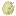
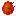
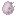

[⬅️ Retour à l'index des mods](../README.md)

---

## Acacia Birdcage
**ID Technique** : `exoticbirds:acacia_birdcage` | **Machine** : `minecraft:crafting_shaped`

| Emplacement | Ingrédient | Icône |
| :--- | :--- | :--- |
| A | Ingots/Iron |  |
| S | Rods/Wooden |  |
| W | Acacia Slab |  |

---
## {}
**ID Technique** : `{}` | **Machine** : `Standard`

| Emplacement | Ingrédient | Icône |
| :--- | :--- | :--- |

---
## Ambrosia
**ID Technique** : `exoticbirds:ambrosia` | **Machine** : `minecraft:crafting_shapeless`

| Emplacement | Ingrédient | Icône |
| :--- | :--- | :--- |
| - | Glow Berries |  |
| - | Apple |  |
| - | Honey Bottle |  |

---
## Ambrosia
**ID Technique** : `exoticbirds:ambrosia` | **Machine** : `minecraft:crafting_shapeless`

| Emplacement | Ingrédient | Icône |
| :--- | :--- | :--- |
| - | Sweet Berries |  |
| - | Apple |  |
| - | Honey Bottle |  |

---
## Birch Birdcage
**ID Technique** : `exoticbirds:birch_birdcage` | **Machine** : `minecraft:crafting_shaped`

| Emplacement | Ingrédient | Icône |
| :--- | :--- | :--- |
| A | Ingots/Iron |  |
| S | Rods/Wooden |  |
| W | Birch Slab |  |

---
## Bird Book
**ID Technique** : `exoticbirds:bird_book` | **Machine** : `minecraft:crafting_shaped`

| Emplacement | Ingrédient | Icône |
| :--- | :--- | :--- |
| A | Feathers |  |
| X | Book |  |

---
## Black Birdhouse
**ID Technique** : `exoticbirds:black_birdhouse` | **Machine** : `minecraft:crafting_shaped`

| Emplacement | Ingrédient | Icône |
| :--- | :--- | :--- |
| A | Dyes/Black |  |
| W | Planks |  |

---
## Blue Birdhouse
**ID Technique** : `exoticbirds:blue_birdhouse` | **Machine** : `minecraft:crafting_shaped`

| Emplacement | Ingrédient | Icône |
| :--- | :--- | :--- |
| A | Dyes/Blue |  |
| W | Planks |  |

---
## Bone Meal
**ID Technique** : `minecraft:bone_meal` | **Machine** : `minecraft:crafting_shapeless`

| Emplacement | Ingrédient | Icône |
| :--- | :--- | :--- |
| - | Eggshell |  |

---
## Brown Birdhouse
**ID Technique** : `exoticbirds:brown_birdhouse` | **Machine** : `minecraft:crafting_shaped`

| Emplacement | Ingrédient | Icône |
| :--- | :--- | :--- |
| A | Dyes/Brown |  |
| W | Planks |  |

---
## Cooked Birdmeat
**ID Technique** : `exoticbirds:cooked_birdmeat` | **Machine** : `minecraft:smelting`

| Emplacement | Ingrédient | Icône |
| :--- | :--- | :--- |
| item | Raw Birdmeat |  |

---
## Cooked Birdmeat
**ID Technique** : `exoticbirds:cooked_birdmeat` | **Machine** : `minecraft:campfire_cooking`

| Emplacement | Ingrédient | Icône |
| :--- | :--- | :--- |
| item | Raw Birdmeat |  |

---
## Cooked Birdmeat
**ID Technique** : `exoticbirds:cooked_birdmeat` | **Machine** : `minecraft:smoking`

| Emplacement | Ingrédient | Icône |
| :--- | :--- | :--- |
| item | Raw Birdmeat |  |

---
## Crimson Birdcage
**ID Technique** : `exoticbirds:crimson_birdcage` | **Machine** : `minecraft:crafting_shaped`

| Emplacement | Ingrédient | Icône |
| :--- | :--- | :--- |
| A | Ingots/Iron |  |
| S | Rods/Wooden |  |
| W | Crimson Slab |  |

---
## Cyan Birdhouse
**ID Technique** : `exoticbirds:cyan_birdhouse` | **Machine** : `minecraft:crafting_shaped`

| Emplacement | Ingrédient | Icône |
| :--- | :--- | :--- |
| A | Dyes/Cyan |  |
| W | Planks |  |

---
## Dark Oak Birdcage
**ID Technique** : `exoticbirds:dark_oak_birdcage` | **Machine** : `minecraft:crafting_shaped`

| Emplacement | Ingrédient | Icône |
| :--- | :--- | :--- |
| A | Ingots/Iron |  |
| S | Rods/Wooden |  |
| W | Dark Oak Slab |  |

---
## {}
**ID Technique** : `{}` | **Machine** : `exoticbirds:crafting_special_dusteggs`

| Emplacement | Ingrédient | Icône |
| :--- | :--- | :--- |

---
## Egg Identifier
**ID Technique** : `exoticbirds:egg_identifier` | **Machine** : `minecraft:crafting_shaped`

| Emplacement | Ingrédient | Icône |
| :--- | :--- | :--- |
| A | Glass/Colorless |  |
| B | Ingots/Iron |  |
| C | Bucket |  |
| D | Dusts/Redstone |  |

---
## Egg Incubator
**ID Technique** : `exoticbirds:egg_incubator` | **Machine** : `minecraft:crafting_shaped`

| Emplacement | Ingrédient | Icône |
| :--- | :--- | :--- |
| A | Glass/Colorless |  |
| B | Ingots/Iron |  |
| C | Bucket |  |
| D | Flint And Steel |  |

---
## Gold Birdcage
**ID Technique** : `exoticbirds:gold_birdcage` | **Machine** : `minecraft:crafting_shaped`

| Emplacement | Ingrédient | Icône |
| :--- | :--- | :--- |
| A | Ingots/Gold |  |
| S | Rods/Wooden |  |

---
## Gray Birdhouse
**ID Technique** : `exoticbirds:gray_birdhouse` | **Machine** : `minecraft:crafting_shaped`

| Emplacement | Ingrédient | Icône |
| :--- | :--- | :--- |
| A | Dyes/Gray |  |
| W | Planks |  |

---
## Green Birdhouse
**ID Technique** : `exoticbirds:green_birdhouse` | **Machine** : `minecraft:crafting_shaped`

| Emplacement | Ingrédient | Icône |
| :--- | :--- | :--- |
| A | Dyes/Green |  |
| W | Planks |  |

---
## Hummingbird Feeder
**ID Technique** : `exoticbirds:hummingbird_feeder` | **Machine** : `minecraft:crafting_shaped`

| Emplacement | Ingrédient | Icône |
| :--- | :--- | :--- |
| S | String |  |
| I | Ingots/Iron |  |
| W | Wooden Slabs |  |

---
## Iron Birdcage
**ID Technique** : `exoticbirds:iron_birdcage` | **Machine** : `minecraft:crafting_shaped`

| Emplacement | Ingrédient | Icône |
| :--- | :--- | :--- |
| A | Ingots/Iron |  |
| S | Rods/Wooden |  |

---
## Jungle Birdcage
**ID Technique** : `exoticbirds:jungle_birdcage` | **Machine** : `minecraft:crafting_shaped`

| Emplacement | Ingrédient | Icône |
| :--- | :--- | :--- |
| A | Ingots/Iron |  |
| S | Rods/Wooden |  |
| W | Jungle Slab |  |

---
## Light Blue Birdhouse
**ID Technique** : `exoticbirds:light_blue_birdhouse` | **Machine** : `minecraft:crafting_shaped`

| Emplacement | Ingrédient | Icône |
| :--- | :--- | :--- |
| A | Dyes/Light Blue |  |
| W | Planks |  |

---
## Light Gray Birdhouse
**ID Technique** : `exoticbirds:light_gray_birdhouse` | **Machine** : `minecraft:crafting_shaped`

| Emplacement | Ingrédient | Icône |
| :--- | :--- | :--- |
| A | Dyes/Light Gray |  |
| W | Planks |  |

---
## Lime Birdhouse
**ID Technique** : `exoticbirds:lime_birdhouse` | **Machine** : `minecraft:crafting_shaped`

| Emplacement | Ingrédient | Icône |
| :--- | :--- | :--- |
| A | Dyes/Lime |  |
| W | Planks |  |

---
## Magenta Birdhouse
**ID Technique** : `exoticbirds:magenta_birdhouse` | **Machine** : `minecraft:crafting_shaped`

| Emplacement | Ingrédient | Icône |
| :--- | :--- | :--- |
| A | Dyes/Magenta |  |
| W | Planks |  |

---
## Mangrove Birdcage
**ID Technique** : `exoticbirds:mangrove_birdcage` | **Machine** : `minecraft:crafting_shaped`

| Emplacement | Ingrédient | Icône |
| :--- | :--- | :--- |
| A | Ingots/Iron |  |
| S | Rods/Wooden |  |
| W | Mangrove Slab |  |

---
## Nest
**ID Technique** : `exoticbirds:nest` | **Machine** : `minecraft:crafting_shaped`

| Emplacement | Ingrédient | Icône |
| :--- | :--- | :--- |
| A | Rods/Wooden |  |

---
## Oak Birdcage
**ID Technique** : `exoticbirds:oak_birdcage` | **Machine** : `minecraft:crafting_shaped`

| Emplacement | Ingrédient | Icône |
| :--- | :--- | :--- |
| A | Ingots/Iron |  |
| S | Rods/Wooden |  |
| W | Oak Slab |  |

---
## Orange Birdhouse
**ID Technique** : `exoticbirds:orange_birdhouse` | **Machine** : `minecraft:crafting_shaped`

| Emplacement | Ingrédient | Icône |
| :--- | :--- | :--- |
| A | Dyes/Orange |  |
| W | Planks |  |

---
## Phoenix Egg
**ID Technique** : `exoticbirds:phoenix_egg` | **Machine** : `minecraft:crafting_shapeless`

| Emplacement | Ingrédient | Icône |
| :--- | :--- | :--- |
| - | Cloud Phoenix Egg |  |

---
## Phoenix Egg
**ID Technique** : `exoticbirds:phoenix_egg` | **Machine** : `minecraft:crafting_shapeless`

| Emplacement | Ingrédient | Icône |
| :--- | :--- | :--- |
| - | Desert Phoenix Egg |  |

---
## Phoenix Egg
**ID Technique** : `exoticbirds:phoenix_egg` | **Machine** : `minecraft:crafting_shapeless`

| Emplacement | Ingrédient | Icône |
| :--- | :--- | :--- |
| - | Ender Phoenix Egg |  |

---
## Phoenix Egg
**ID Technique** : `exoticbirds:phoenix_egg` | **Machine** : `minecraft:crafting_shapeless`

| Emplacement | Ingrédient | Icône |
| :--- | :--- | :--- |
| - | Fire Phoenix Egg |  |

---
## Phoenix Egg
**ID Technique** : `exoticbirds:phoenix_egg` | **Machine** : `minecraft:crafting_shapeless`

| Emplacement | Ingrédient | Icône |
| :--- | :--- | :--- |
| - | Nether Phoenix Egg |  |

---
## Phoenix Egg
**ID Technique** : `exoticbirds:phoenix_egg` | **Machine** : `minecraft:crafting_shapeless`

| Emplacement | Ingrédient | Icône |
| :--- | :--- | :--- |
| - | Skeleton Phoenix Egg |  |

---
## Phoenix Egg
**ID Technique** : `exoticbirds:phoenix_egg` | **Machine** : `minecraft:crafting_shapeless`

| Emplacement | Ingrédient | Icône |
| :--- | :--- | :--- |
| - | Snowy Phoenix Egg |  |

---
## Phoenix Egg
**ID Technique** : `exoticbirds:phoenix_egg` | **Machine** : `minecraft:crafting_shapeless`

| Emplacement | Ingrédient | Icône |
| :--- | :--- | :--- |
| - | Twilight Phoenix Egg |  |

---
## Phoenix Egg
**ID Technique** : `exoticbirds:phoenix_egg` | **Machine** : `minecraft:crafting_shapeless`

| Emplacement | Ingrédient | Icône |
| :--- | :--- | :--- |
| - | Water Phoenix Egg |  |

---
## Pigeon Backpack
**ID Technique** : `exoticbirds:pigeon_backpack` | **Machine** : `minecraft:crafting_shaped`

| Emplacement | Ingrédient | Icône |
| :--- | :--- | :--- |
| A | Chests/Wooden |  |
| S | Leather |  |
| F | Feathers |  |

---
## Pink Birdhouse
**ID Technique** : `exoticbirds:pink_birdhouse` | **Machine** : `minecraft:crafting_shaped`

| Emplacement | Ingrédient | Icône |
| :--- | :--- | :--- |
| A | Dyes/Pink |  |
| W | Planks |  |

---
## Purple Birdhouse
**ID Technique** : `exoticbirds:purple_birdhouse` | **Machine** : `minecraft:crafting_shaped`

| Emplacement | Ingrédient | Icône |
| :--- | :--- | :--- |
| A | Dyes/Purple |  |
| W | Planks |  |

---
## Red Birdhouse
**ID Technique** : `exoticbirds:red_birdhouse` | **Machine** : `minecraft:crafting_shaped`

| Emplacement | Ingrédient | Icône |
| :--- | :--- | :--- |
| A | Dyes/Red |  |
| W | Planks |  |

---
## Roost Box
**ID Technique** : `exoticbirds:roost_box` | **Machine** : `minecraft:crafting_shaped`

| Emplacement | Ingrédient | Icône |
| :--- | :--- | :--- |
| X | Planks |  |
| O | Iron Bars |  |

---
## Spruce Birdcage
**ID Technique** : `exoticbirds:spruce_birdcage` | **Machine** : `minecraft:crafting_shaped`

| Emplacement | Ingrédient | Icône |
| :--- | :--- | :--- |
| A | Ingots/Iron |  |
| S | Rods/Wooden |  |
| W | Spruce Slab |  |

---
## Warped Birdcage
**ID Technique** : `exoticbirds:warped_birdcage` | **Machine** : `minecraft:crafting_shaped`

| Emplacement | Ingrédient | Icône |
| :--- | :--- | :--- |
| A | Ingots/Iron |  |
| S | Rods/Wooden |  |
| W | Warped Slab |  |

---
## White Birdhouse
**ID Technique** : `exoticbirds:white_birdhouse` | **Machine** : `minecraft:crafting_shaped`

| Emplacement | Ingrédient | Icône |
| :--- | :--- | :--- |
| A | Dyes/White |  |
| W | Planks |  |

---
## Yellow Birdhouse
**ID Technique** : `exoticbirds:yellow_birdhouse` | **Machine** : `minecraft:crafting_shaped`

| Emplacement | Ingrédient | Icône |
| :--- | :--- | :--- |
| A | Dyes/Yellow |  |
| W | Planks |  |

---
