## Amethyst Shard
**ID Technique** : `minecraft:amethyst_shard` | **Machine** : `minecraft:smelting`

| Emplacement | Ingrédient | Icône |
| :--- | :--- | :--- |
| item | Amethyst Dust |  |

---
## Apple Boat
**ID Technique** : `terraqueous:apple_boat` | **Machine** : `minecraft:crafting_shaped`

| Emplacement | Ingrédient | Icône |
| :--- | :--- | :--- |
| # | Apple Planks | 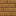 |

---
## Apple Button
**ID Technique** : `terraqueous:apple_button` | **Machine** : `minecraft:crafting_shapeless`

| Emplacement | Ingrédient | Icône |
| :--- | :--- | :--- |
| - | Apple Planks |  |

---
## Apple Chest Boat
**ID Technique** : `terraqueous:apple_chest_boat` | **Machine** : `minecraft:crafting_shapeless`

| Emplacement | Ingrédient | Icône |
| :--- | :--- | :--- |
| - | Chests/Wooden |  |
| - | Apple Boat |  |

---
## Apple Door
**ID Technique** : `terraqueous:apple_door` | **Machine** : `minecraft:crafting_shaped`

| Emplacement | Ingrédient | Icône |
| :--- | :--- | :--- |
| # | Apple Planks |  |

---
## Apple Fence
**ID Technique** : `terraqueous:apple_fence` | **Machine** : `minecraft:crafting_shaped`

| Emplacement | Ingrédient | Icône |
| :--- | :--- | :--- |
| # | Rods/Wooden |  |
| W | Apple Planks |  |

---
## Apple Fence Gate
**ID Technique** : `terraqueous:apple_fence_gate` | **Machine** : `minecraft:crafting_shaped`

| Emplacement | Ingrédient | Icône |
| :--- | :--- | :--- |
| # | Rods/Wooden |  |
| W | Apple Planks |  |

---
## Apple Planks
**ID Technique** : `terraqueous:apple_planks` | **Machine** : `minecraft:crafting_shapeless`

| Emplacement | Ingrédient | Icône |
| :--- | :--- | :--- |
| - | Apple Logs |  |

---
## Apple Pressure Plate
**ID Technique** : `terraqueous:apple_pressure_plate` | **Machine** : `minecraft:crafting_shaped`

| Emplacement | Ingrédient | Icône |
| :--- | :--- | :--- |
| # | Apple Planks |  |

---
## Apple Sapling
**ID Technique** : `terraqueous:apple_sapling` | **Machine** : `minecraft:crafting_shapeless`

| Emplacement | Ingrédient | Icône |
| :--- | :--- | :--- |
| - | Apple |  |
| - | Apple Leaves |  |
| - | Apple Logs |  |

---
## Apple Sign
**ID Technique** : `terraqueous:apple_sign` | **Machine** : `minecraft:crafting_shaped`

| Emplacement | Ingrédient | Icône |
| :--- | :--- | :--- |
| # | Apple Planks |  |
| X | Rods/Wooden |  |

---
## Apple Slab
**ID Technique** : `terraqueous:apple_slab` | **Machine** : `minecraft:crafting_shaped`

| Emplacement | Ingrédient | Icône |
| :--- | :--- | :--- |
| # | Apple Planks |  |

---
## Apple Stairs
**ID Technique** : `terraqueous:apple_stairs` | **Machine** : `minecraft:crafting_shaped`

| Emplacement | Ingrédient | Icône |
| :--- | :--- | :--- |
| # | Apple Planks |  |

---
## Apple Trapdoor
**ID Technique** : `terraqueous:apple_trapdoor` | **Machine** : `minecraft:crafting_shaped`

| Emplacement | Ingrédient | Icône |
| :--- | :--- | :--- |
| # | Apple Planks |  |

---
## Apple Wood
**ID Technique** : `terraqueous:apple_wood` | **Machine** : `minecraft:crafting_shaped`

| Emplacement | Ingrédient | Icône |
| :--- | :--- | :--- |
| # | Apple Log | 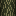 |

---
## Assembled Cloud Talisman
**ID Technique** : `terraqueous:assembled_cloud_talisman` | **Machine** : `minecraft:crafting_shaped`

| Emplacement | Ingrédient | Icône |
| :--- | :--- | :--- |
| E | Gems/Endimium |  |
| M | Phantom Membrane |  |

---
## Auspicious Garden Fence
**ID Technique** : `terraqueous:auspicious_garden_fence` | **Machine** : `minecraft:crafting_shaped`

| Emplacement | Ingrédient | Icône |
| :--- | :--- | :--- |
| F | Trickster Bloom |  |
| I | Ingots/Iron |  |

---
## Banana Boat
**ID Technique** : `terraqueous:banana_boat` | **Machine** : `minecraft:crafting_shaped`

| Emplacement | Ingrédient | Icône |
| :--- | :--- | :--- |
| # | Banana Planks |  |

---
## Banana Button
**ID Technique** : `terraqueous:banana_button` | **Machine** : `minecraft:crafting_shapeless`

| Emplacement | Ingrédient | Icône |
| :--- | :--- | :--- |
| - | Banana Planks |  |

---
## Banana Chest Boat
**ID Technique** : `terraqueous:banana_chest_boat` | **Machine** : `minecraft:crafting_shapeless`

| Emplacement | Ingrédient | Icône |
| :--- | :--- | :--- |
| - | Chests/Wooden |  |
| - | Banana Boat |  |

---
## Banana Door
**ID Technique** : `terraqueous:banana_door` | **Machine** : `minecraft:crafting_shaped`

| Emplacement | Ingrédient | Icône |
| :--- | :--- | :--- |
| # | Banana Planks |  |

---
## Banana Fence
**ID Technique** : `terraqueous:banana_fence` | **Machine** : `minecraft:crafting_shaped`

| Emplacement | Ingrédient | Icône |
| :--- | :--- | :--- |
| # | Rods/Wooden |  |
| W | Banana Planks |  |

---
## Banana Fence Gate
**ID Technique** : `terraqueous:banana_fence_gate` | **Machine** : `minecraft:crafting_shaped`

| Emplacement | Ingrédient | Icône |
| :--- | :--- | :--- |
| # | Rods/Wooden |  |
| W | Banana Planks |  |

---
## Banana Planks
**ID Technique** : `terraqueous:banana_planks` | **Machine** : `minecraft:crafting_shapeless`

| Emplacement | Ingrédient | Icône |
| :--- | :--- | :--- |
| - | Banana Logs |  |

---
## Banana Pressure Plate
**ID Technique** : `terraqueous:banana_pressure_plate` | **Machine** : `minecraft:crafting_shaped`

| Emplacement | Ingrédient | Icône |
| :--- | :--- | :--- |
| # | Banana Planks |  |

---
## Banana Sapling
**ID Technique** : `terraqueous:banana_sapling` | **Machine** : `minecraft:crafting_shapeless`

| Emplacement | Ingrédient | Icône |
| :--- | :--- | :--- |
| - | Banana |  |
| - | Banana Leaves |  |
| - | Banana Logs |  |

---
## Banana Sign
**ID Technique** : `terraqueous:banana_sign` | **Machine** : `minecraft:crafting_shaped`

| Emplacement | Ingrédient | Icône |
| :--- | :--- | :--- |
| # | Banana Planks |  |
| X | Rods/Wooden |  |

---
## Banana Slab
**ID Technique** : `terraqueous:banana_slab` | **Machine** : `minecraft:crafting_shaped`

| Emplacement | Ingrédient | Icône |
| :--- | :--- | :--- |
| # | Banana Planks |  |

---
## Banana Stairs
**ID Technique** : `terraqueous:banana_stairs` | **Machine** : `minecraft:crafting_shaped`

| Emplacement | Ingrédient | Icône |
| :--- | :--- | :--- |
| # | Banana Planks |  |

---
## Banana Trapdoor
**ID Technique** : `terraqueous:banana_trapdoor` | **Machine** : `minecraft:crafting_shaped`

| Emplacement | Ingrédient | Icône |
| :--- | :--- | :--- |
| # | Banana Planks |  |

---
## Banana Wood
**ID Technique** : `terraqueous:banana_wood` | **Machine** : `minecraft:crafting_shaped`

| Emplacement | Ingrédient | Icône |
| :--- | :--- | :--- |
| # | Banana Log | 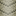 |

---
## Beveled Burnium Block
**ID Technique** : `terraqueous:beveled_burnium_block` | **Machine** : `minecraft:crafting_shaped`

| Emplacement | Ingrédient | Icône |
| :--- | :--- | :--- |
| # | Burnium Blocks |  |

---
## Beveled Endimium Block
**ID Technique** : `terraqueous:beveled_endimium_block` | **Machine** : `minecraft:crafting_shaped`

| Emplacement | Ingrédient | Icône |
| :--- | :--- | :--- |
| # | Endimium Blocks |  |

---
## Black Concrete Capital
**ID Technique** : `terraqueous:black_concrete_capital` | **Machine** : `minecraft:crafting_shaped`

| Emplacement | Ingrédient | Icône |
| :--- | :--- | :--- |
| # | Black Concrete |  |

---
## Black Concrete Column
**ID Technique** : `terraqueous:black_concrete_column` | **Machine** : `minecraft:crafting_shaped`

| Emplacement | Ingrédient | Icône |
| :--- | :--- | :--- |
| # | Black Concrete |  |

---
## Black Concrete Edge
**ID Technique** : `terraqueous:black_concrete_edge` | **Machine** : `minecraft:crafting_shaped`

| Emplacement | Ingrédient | Icône |
| :--- | :--- | :--- |
| @ | Black Concrete Powder |  |
| # | Black Concrete |  |

---
## Black Dye
**ID Technique** : `minecraft:black_dye` | **Machine** : `minecraft:crafting_shapeless`

| Emplacement | Ingrédient | Icône |
| :--- | :--- | :--- |
| - | Black Pansy |  |

---
## Black Dye
**ID Technique** : `minecraft:black_dye` | **Machine** : `minecraft:crafting_shapeless`

| Emplacement | Ingrédient | Icône |
| :--- | :--- | :--- |
| - | Black Rose |  |

---
## Blue Concrete Capital
**ID Technique** : `terraqueous:blue_concrete_capital` | **Machine** : `minecraft:crafting_shaped`

| Emplacement | Ingrédient | Icône |
| :--- | :--- | :--- |
| # | Blue Concrete |  |

---
## Blue Concrete Column
**ID Technique** : `terraqueous:blue_concrete_column` | **Machine** : `minecraft:crafting_shaped`

| Emplacement | Ingrédient | Icône |
| :--- | :--- | :--- |
| # | Blue Concrete |  |

---
## Blue Concrete Edge
**ID Technique** : `terraqueous:blue_concrete_edge` | **Machine** : `minecraft:crafting_shaped`

| Emplacement | Ingrédient | Icône |
| :--- | :--- | :--- |
| @ | Blue Concrete Powder |  |
| # | Blue Concrete |  |

---
## Blue Dye
**ID Technique** : `minecraft:blue_dye` | **Machine** : `minecraft:crafting_shapeless`

| Emplacement | Ingrédient | Icône |
| :--- | :--- | :--- |
| - | Trickster Bloom |  |

---
## Brown Concrete Capital
**ID Technique** : `terraqueous:brown_concrete_capital` | **Machine** : `minecraft:crafting_shaped`

| Emplacement | Ingrédient | Icône |
| :--- | :--- | :--- |
| # | Brown Concrete |  |

---
## Brown Concrete Column
**ID Technique** : `terraqueous:brown_concrete_column` | **Machine** : `minecraft:crafting_shaped`

| Emplacement | Ingrédient | Icône |
| :--- | :--- | :--- |
| # | Brown Concrete |  |

---
## Brown Concrete Edge
**ID Technique** : `terraqueous:brown_concrete_edge` | **Machine** : `minecraft:crafting_shaped`

| Emplacement | Ingrédient | Icône |
| :--- | :--- | :--- |
| @ | Brown Concrete Powder |  |
| # | Brown Concrete |  |

---
## Brown Dye
**ID Technique** : `minecraft:brown_dye` | **Machine** : `minecraft:crafting_shapeless`

| Emplacement | Ingrédient | Icône |
| :--- | :--- | :--- |
| - | Burdock |  |

---
## Burnium Belt
**ID Technique** : `terraqueous:burnium_belt` | **Machine** : `minecraft:crafting_shaped`

| Emplacement | Ingrédient | Icône |
| :--- | :--- | :--- |
| C | Gems/Burnium |  |
| G | Nuggets/Gold |  |
| M | Magma Cream |  |
| L | Leather |  |

---
## Burnium Block
**ID Technique** : `terraqueous:burnium_block` | **Machine** : `minecraft:crafting_shaped`

| Emplacement | Ingrédient | Icône |
| :--- | :--- | :--- |
| # | Burnium Gem |  |

---
## Burnium Dust
**ID Technique** : `terraqueous:burnium_dust` | **Machine** : `minecraft:crafting_shapeless`

| Emplacement | Ingrédient | Icône |
| :--- | :--- | :--- |
| - | Dusts/Coal |  |
| - | Blaze Powder |  |

---
## Burnium Gem
**ID Technique** : `terraqueous:burnium_gem` | **Machine** : `minecraft:crafting_shapeless`

| Emplacement | Ingrédient | Icône |
| :--- | :--- | :--- |
| - | Burnium Blocks |  |

---
## Burnium Gem
**ID Technique** : `terraqueous:burnium_gem` | **Machine** : `minecraft:smelting`

| Emplacement | Ingrédient | Icône |
| :--- | :--- | :--- |
| item | Burnium Dust |  |

---
## Cactus
**ID Technique** : `terraqueous:cactus` | **Machine** : `minecraft:crafting_shapeless`

| Emplacement | Ingrédient | Icône |
| :--- | :--- | :--- |
| - | Cactus |  |
| - | Pricklypear |  |

---
## Cherry Boat
**ID Technique** : `terraqueous:cherry_boat` | **Machine** : `minecraft:crafting_shaped`

| Emplacement | Ingrédient | Icône |
| :--- | :--- | :--- |
| # | Cherry Planks | 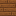 |

---
## Cherry Button
**ID Technique** : `terraqueous:cherry_button` | **Machine** : `minecraft:crafting_shapeless`

| Emplacement | Ingrédient | Icône |
| :--- | :--- | :--- |
| - | Cherry Planks |  |

---
## Cherry Chest Boat
**ID Technique** : `terraqueous:cherry_chest_boat` | **Machine** : `minecraft:crafting_shapeless`

| Emplacement | Ingrédient | Icône |
| :--- | :--- | :--- |
| - | Chests/Wooden |  |
| - | Cherry Boat | 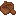 |

---
## Cherry Door
**ID Technique** : `terraqueous:cherry_door` | **Machine** : `minecraft:crafting_shaped`

| Emplacement | Ingrédient | Icône |
| :--- | :--- | :--- |
| # | Cherry Planks |  |

---
## Cherry Fence
**ID Technique** : `terraqueous:cherry_fence` | **Machine** : `minecraft:crafting_shaped`

| Emplacement | Ingrédient | Icône |
| :--- | :--- | :--- |
| # | Rods/Wooden |  |
| W | Cherry Planks |  |

---
## Cherry Fence Gate
**ID Technique** : `terraqueous:cherry_fence_gate` | **Machine** : `minecraft:crafting_shaped`

| Emplacement | Ingrédient | Icône |
| :--- | :--- | :--- |
| # | Rods/Wooden |  |
| W | Cherry Planks |  |

---
## Cherry Planks
**ID Technique** : `terraqueous:cherry_planks` | **Machine** : `minecraft:crafting_shapeless`

| Emplacement | Ingrédient | Icône |
| :--- | :--- | :--- |
| - | Cherry Logs |  |

---
## Cherry Pressure Plate
**ID Technique** : `terraqueous:cherry_pressure_plate` | **Machine** : `minecraft:crafting_shaped`

| Emplacement | Ingrédient | Icône |
| :--- | :--- | :--- |
| # | Cherry Planks |  |

---
## Cherry Sapling
**ID Technique** : `terraqueous:cherry_sapling` | **Machine** : `minecraft:crafting_shapeless`

| Emplacement | Ingrédient | Icône |
| :--- | :--- | :--- |
| - | Cherry |  |
| - | Cherry Leaves |  |
| - | Cherry Logs |  |

---
## Cherry Sign
**ID Technique** : `terraqueous:cherry_sign` | **Machine** : `minecraft:crafting_shaped`

| Emplacement | Ingrédient | Icône |
| :--- | :--- | :--- |
| # | Cherry Planks |  |
| X | Rods/Wooden |  |

---
## Cherry Slab
**ID Technique** : `terraqueous:cherry_slab` | **Machine** : `minecraft:crafting_shaped`

| Emplacement | Ingrédient | Icône |
| :--- | :--- | :--- |
| # | Cherry Planks |  |

---
## Cherry Stairs
**ID Technique** : `terraqueous:cherry_stairs` | **Machine** : `minecraft:crafting_shaped`

| Emplacement | Ingrédient | Icône |
| :--- | :--- | :--- |
| # | Cherry Planks |  |

---
## Cherry Trapdoor
**ID Technique** : `terraqueous:cherry_trapdoor` | **Machine** : `minecraft:crafting_shaped`

| Emplacement | Ingrédient | Icône |
| :--- | :--- | :--- |
| # | Cherry Planks |  |

---
## Cherry Wood
**ID Technique** : `terraqueous:cherry_wood` | **Machine** : `minecraft:crafting_shaped`

| Emplacement | Ingrédient | Icône |
| :--- | :--- | :--- |
| # | Cherry Log | 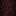 |

---
## Cloud Craftbench
**ID Technique** : `terraqueous:cloud_craftbench` | **Machine** : `minecraft:crafting_shaped`

| Emplacement | Ingrédient | Icône |
| :--- | :--- | :--- |
| # | Storm Cloud |  |
| @ | Cloud Workbench |  |

---
## Cloud Craftfurnace
**ID Technique** : `terraqueous:cloud_craftfurnace` | **Machine** : `minecraft:crafting_shaped`

| Emplacement | Ingrédient | Icône |
| :--- | :--- | :--- |
| # | Storm Cloud |  |
| @ | Cloud Furnace |  |

---
## Cloud Furnace
**ID Technique** : `terraqueous:cloud_furnace` | **Machine** : `minecraft:crafting_shaped`

| Emplacement | Ingrédient | Icône |
| :--- | :--- | :--- |
| # | Storm Cloud |  |

---
## Cloud Staff
**ID Technique** : `terraqueous:cloud_staff` | **Machine** : `minecraft:crafting_shaped`

| Emplacement | Ingrédient | Icône |
| :--- | :--- | :--- |
| E | Gems/Endimium |  |
| G | Nuggets/Gold |  |
| S | Rods/Wooden |  |

---
## {}
**ID Technique** : `{}` | **Machine** : `terraqueous:cloud_staff_output`

| Emplacement | Ingrédient | Icône |
| :--- | :--- | :--- |

---
## Cloud Workbench
**ID Technique** : `terraqueous:cloud_workbench` | **Machine** : `minecraft:crafting_shaped`

| Emplacement | Ingrédient | Icône |
| :--- | :--- | :--- |
| # | Storm Cloud |  |

---
## Coconut Boat
**ID Technique** : `terraqueous:coconut_boat` | **Machine** : `minecraft:crafting_shaped`

| Emplacement | Ingrédient | Icône |
| :--- | :--- | :--- |
| # | Coconut Planks |  |

---
## Coconut Button
**ID Technique** : `terraqueous:coconut_button` | **Machine** : `minecraft:crafting_shapeless`

| Emplacement | Ingrédient | Icône |
| :--- | :--- | :--- |
| - | Coconut Planks |  |

---
## Coconut Chest Boat
**ID Technique** : `terraqueous:coconut_chest_boat` | **Machine** : `minecraft:crafting_shapeless`

| Emplacement | Ingrédient | Icône |
| :--- | :--- | :--- |
| - | Chests/Wooden |  |
| - | Coconut Boat | 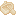 |

---
## Coconut Door
**ID Technique** : `terraqueous:coconut_door` | **Machine** : `minecraft:crafting_shaped`

| Emplacement | Ingrédient | Icône |
| :--- | :--- | :--- |
| # | Coconut Planks |  |

---
## Coconut Fence
**ID Technique** : `terraqueous:coconut_fence` | **Machine** : `minecraft:crafting_shaped`

| Emplacement | Ingrédient | Icône |
| :--- | :--- | :--- |
| # | Rods/Wooden |  |
| W | Coconut Planks |  |

---
## Coconut Fence Gate
**ID Technique** : `terraqueous:coconut_fence_gate` | **Machine** : `minecraft:crafting_shaped`

| Emplacement | Ingrédient | Icône |
| :--- | :--- | :--- |
| # | Rods/Wooden |  |
| W | Coconut Planks |  |

---
## Milk Bucket
**ID Technique** : `minecraft:milk_bucket` | **Machine** : `minecraft:crafting_shapeless`

| Emplacement | Ingrédient | Icône |
| :--- | :--- | :--- |
| - | Coconut | 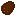 |
| - | Coconut |  |
| - | Coconut |  |
| - | Bucket |  |

---
## Coconut Planks
**ID Technique** : `terraqueous:coconut_planks` | **Machine** : `minecraft:crafting_shapeless`

| Emplacement | Ingrédient | Icône |
| :--- | :--- | :--- |
| - | Coconut Logs |  |

---
## Coconut Pressure Plate
**ID Technique** : `terraqueous:coconut_pressure_plate` | **Machine** : `minecraft:crafting_shaped`

| Emplacement | Ingrédient | Icône |
| :--- | :--- | :--- |
| # | Coconut Planks |  |

---
## Coconut Sapling
**ID Technique** : `terraqueous:coconut_sapling` | **Machine** : `minecraft:crafting_shapeless`

| Emplacement | Ingrédient | Icône |
| :--- | :--- | :--- |
| - | Coconut |  |
| - | Coconut Leaves | 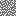 |
| - | Coconut Logs |  |

---
## Coconut Sign
**ID Technique** : `terraqueous:coconut_sign` | **Machine** : `minecraft:crafting_shaped`

| Emplacement | Ingrédient | Icône |
| :--- | :--- | :--- |
| # | Coconut Planks |  |
| X | Rods/Wooden |  |

---
## Coconut Slab
**ID Technique** : `terraqueous:coconut_slab` | **Machine** : `minecraft:crafting_shaped`

| Emplacement | Ingrédient | Icône |
| :--- | :--- | :--- |
| # | Coconut Planks |  |

---
## Coconut Stairs
**ID Technique** : `terraqueous:coconut_stairs` | **Machine** : `minecraft:crafting_shaped`

| Emplacement | Ingrédient | Icône |
| :--- | :--- | :--- |
| # | Coconut Planks |  |

---
## Coconut Trapdoor
**ID Technique** : `terraqueous:coconut_trapdoor` | **Machine** : `minecraft:crafting_shaped`

| Emplacement | Ingrédient | Icône |
| :--- | :--- | :--- |
| # | Coconut Planks |  |

---
## Coconut Wood
**ID Technique** : `terraqueous:coconut_wood` | **Machine** : `minecraft:crafting_shaped`

| Emplacement | Ingrédient | Icône |
| :--- | :--- | :--- |
| # | Coconut Log | 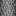 |

---
## Colorizer
**ID Technique** : `terraqueous:colorizer` | **Machine** : `minecraft:crafting_shaped`

| Emplacement | Ingrédient | Icône |
| :--- | :--- | :--- |
| R | Dyes/Red |  |
| G | Dyes/Green |  |
| B | Dyes/Blue |  |
| P | Glass Panes |  |
| I | Ingots/Iron |  |

---
## Copper Ingot
**ID Technique** : `minecraft:copper_ingot` | **Machine** : `minecraft:blasting`

| Emplacement | Ingrédient | Icône |
| :--- | :--- | :--- |
| item | Copper Dust | 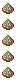 |

---
## Copper Ingot
**ID Technique** : `minecraft:copper_ingot` | **Machine** : `minecraft:smelting`

| Emplacement | Ingrédient | Icône |
| :--- | :--- | :--- |
| item | Copper Dust |  |

---
## Craftbench
**ID Technique** : `terraqueous:craftbench` | **Machine** : `minecraft:crafting_shaped`

| Emplacement | Ingrédient | Icône |
| :--- | :--- | :--- |
| # | Stone |  |
| @ | Workbench |  |

---
## Craftfurnace
**ID Technique** : `terraqueous:craftfurnace` | **Machine** : `minecraft:crafting_shaped`

| Emplacement | Ingrédient | Icône |
| :--- | :--- | :--- |
| # | Stone |  |
| @ | Furnace |  |

---
## Cyan Concrete Capital
**ID Technique** : `terraqueous:cyan_concrete_capital` | **Machine** : `minecraft:crafting_shaped`

| Emplacement | Ingrédient | Icône |
| :--- | :--- | :--- |
| # | Cyan Concrete |  |

---
## Cyan Concrete Column
**ID Technique** : `terraqueous:cyan_concrete_column` | **Machine** : `minecraft:crafting_shaped`

| Emplacement | Ingrédient | Icône |
| :--- | :--- | :--- |
| # | Cyan Concrete |  |

---
## Cyan Concrete Edge
**ID Technique** : `terraqueous:cyan_concrete_edge` | **Machine** : `minecraft:crafting_shaped`

| Emplacement | Ingrédient | Icône |
| :--- | :--- | :--- |
| @ | Cyan Concrete Powder |  |
| # | Cyan Concrete |  |

---
## Cyan Dye
**ID Technique** : `minecraft:cyan_dye` | **Machine** : `minecraft:crafting_shapeless`

| Emplacement | Ingrédient | Icône |
| :--- | :--- | :--- |
| - | Leichtlinii |  |

---
## Deathvine
**ID Technique** : `terraqueous:deathvine` | **Machine** : `minecraft:crafting_shapeless`

| Emplacement | Ingrédient | Icône |
| :--- | :--- | :--- |
| - | Vine | 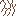 |
| - | Deathfruit |  |

---
## Dense Cloud
**ID Technique** : `terraqueous:dense_cloud` | **Machine** : `minecraft:crafting_shaped`

| Emplacement | Ingrédient | Icône |
| :--- | :--- | :--- |
| # | Light Cloud |  |

---
## Dense Cloud Button
**ID Technique** : `terraqueous:dense_cloud_button` | **Machine** : `minecraft:crafting_shapeless`

| Emplacement | Ingrédient | Icône |
| :--- | :--- | :--- |
| - | Dense Cloud |  |

---
## Dense Cloud Capital
**ID Technique** : `terraqueous:dense_cloud_capital` | **Machine** : `minecraft:crafting_shaped`

| Emplacement | Ingrédient | Icône |
| :--- | :--- | :--- |
| # | Dense Cloud |  |

---
## Dense Cloud Chest Raft
**ID Technique** : `terraqueous:dense_cloud_chest_raft` | **Machine** : `minecraft:crafting_shapeless`

| Emplacement | Ingrédient | Icône |
| :--- | :--- | :--- |
| - | Chests/Wooden |  |
| - | Dense Cloud Raft |  |

---
## Dense Cloud Column
**ID Technique** : `terraqueous:dense_cloud_column` | **Machine** : `minecraft:crafting_shaped`

| Emplacement | Ingrédient | Icône |
| :--- | :--- | :--- |
| # | Dense Cloud |  |

---
## Dense Cloud Door
**ID Technique** : `terraqueous:dense_cloud_door` | **Machine** : `minecraft:crafting_shaped`

| Emplacement | Ingrédient | Icône |
| :--- | :--- | :--- |
| # | Dense Cloud |  |

---
## Dense Cloud Edge
**ID Technique** : `terraqueous:dense_cloud_edge` | **Machine** : `minecraft:crafting_shaped`

| Emplacement | Ingrédient | Icône |
| :--- | :--- | :--- |
| @ | Light Cloud |  |
| # | Dense Cloud |  |

---
## Dense Cloud Fence
**ID Technique** : `terraqueous:dense_cloud_fence` | **Machine** : `minecraft:crafting_shaped`

| Emplacement | Ingrédient | Icône |
| :--- | :--- | :--- |
| # | Vapor Block |  |
| W | Dense Cloud |  |

---
## Dense Cloud Fence Gate
**ID Technique** : `terraqueous:dense_cloud_fence_gate` | **Machine** : `minecraft:crafting_shaped`

| Emplacement | Ingrédient | Icône |
| :--- | :--- | :--- |
| # | Vapor Block |  |
| W | Dense Cloud |  |

---
## Dense Cloud Pressure Plate
**ID Technique** : `terraqueous:dense_cloud_pressure_plate` | **Machine** : `minecraft:crafting_shaped`

| Emplacement | Ingrédient | Icône |
| :--- | :--- | :--- |
| # | Dense Cloud |  |

---
## Dense Cloud Raft
**ID Technique** : `terraqueous:dense_cloud_raft` | **Machine** : `minecraft:crafting_shaped`

| Emplacement | Ingrédient | Icône |
| :--- | :--- | :--- |
| # | Dense Cloud |  |

---
## Dense Cloud Sign
**ID Technique** : `terraqueous:dense_cloud_sign` | **Machine** : `minecraft:crafting_shaped`

| Emplacement | Ingrédient | Icône |
| :--- | :--- | :--- |
| # | Dense Cloud |  |
| X | Vapor Block |  |

---
## Dense Cloud Slab
**ID Technique** : `terraqueous:dense_cloud_slab` | **Machine** : `minecraft:crafting_shaped`

| Emplacement | Ingrédient | Icône |
| :--- | :--- | :--- |
| # | Dense Cloud |  |

---
## Dense Cloud Stairs
**ID Technique** : `terraqueous:dense_cloud_stairs` | **Machine** : `minecraft:crafting_shaped`

| Emplacement | Ingrédient | Icône |
| :--- | :--- | :--- |
| # | Dense Cloud |  |

---
## Dense Cloud Trapdoor
**ID Technique** : `terraqueous:dense_cloud_trapdoor` | **Machine** : `minecraft:crafting_shaped`

| Emplacement | Ingrédient | Icône |
| :--- | :--- | :--- |
| # | Dense Cloud |  |

---
## Diamond
**ID Technique** : `minecraft:diamond` | **Machine** : `minecraft:smelting`

| Emplacement | Ingrédient | Icône |
| :--- | :--- | :--- |
| item | Diamond Dust |  |

---
## Emerald
**ID Technique** : `minecraft:emerald` | **Machine** : `minecraft:smelting`

| Emplacement | Ingrédient | Icône |
| :--- | :--- | :--- |
| item | Emerald Dust |  |

---
## Ender Book
**ID Technique** : `terraqueous:ender_book` | **Machine** : `minecraft:crafting_shapeless`

| Emplacement | Ingrédient | Icône |
| :--- | :--- | :--- |
| - | Book |  |
| - | Ender Eye |  |

---
## Ender Pearl
**ID Technique** : `minecraft:ender_pearl` | **Machine** : `minecraft:smelting`

| Emplacement | Ingrédient | Icône |
| :--- | :--- | :--- |
| item | Ender Dust |  |

---
## Ender Table
**ID Technique** : `terraqueous:ender_table` | **Machine** : `minecraft:crafting_shaped`

| Emplacement | Ingrédient | Icône |
| :--- | :--- | :--- |
| O | Obsidian |  |
| D | Gems/Diamond |  |
| B | Ender Book | 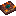 |

---
## Endimium Block
**ID Technique** : `terraqueous:endimium_block` | **Machine** : `minecraft:crafting_shaped`

| Emplacement | Ingrédient | Icône |
| :--- | :--- | :--- |
| # | Endimium Gem |  |

---
## Endimium Dust
**ID Technique** : `terraqueous:endimium_dust` | **Machine** : `minecraft:crafting_shapeless`

| Emplacement | Ingrédient | Icône |
| :--- | :--- | :--- |
| - | Dusts/Ender Pearl |  |
| - | Dusts/Diamond |  |

---
## Endimium Gem
**ID Technique** : `terraqueous:endimium_gem` | **Machine** : `minecraft:crafting_shapeless`

| Emplacement | Ingrédient | Icône |
| :--- | :--- | :--- |
| - | Endimium Blocks |  |

---
## Endimium Gem
**ID Technique** : `terraqueous:endimium_gem` | **Machine** : `minecraft:smelting`

| Emplacement | Ingrédient | Icône |
| :--- | :--- | :--- |
| item | Endimium Dust |  |

---
## Foreboding Garden Fence
**ID Technique** : `terraqueous:foreboding_garden_fence` | **Machine** : `minecraft:crafting_shaped`

| Emplacement | Ingrédient | Icône |
| :--- | :--- | :--- |
| F | Trickster Bloom |  |
| I | Ingots/Iron |  |
| Z | Rotten Flesh |  |

---
## Glass
**ID Technique** : `minecraft:glass` | **Machine** : `minecraft:smelting`

| Emplacement | Ingrédient | Icône |
| :--- | :--- | :--- |
| item | Doodad Glassshards |  |

---
## Glass Pane
**ID Technique** : `minecraft:glass_pane` | **Machine** : `minecraft:smelting`

| Emplacement | Ingrédient | Icône |
| :--- | :--- | :--- |
| item | Glass Shard |  |

---
## Doodad Glassshards
**ID Technique** : `terraqueous:doodad_glassshards` | **Machine** : `minecraft:crafting_shapeless`

| Emplacement | Ingrédient | Icône |
| :--- | :--- | :--- |
| - | Glass Shard |  |
| - | Glass Shard |  |
| - | Glass Shard |  |
| - | Glass Shard |  |

---
## Glow Paper
**ID Technique** : `terraqueous:glow_paper` | **Machine** : `minecraft:crafting_shaped`

| Emplacement | Ingrédient | Icône |
| :--- | :--- | :--- |
| P | Paper |  |
| G | Dusts/Glowstone |  |

---
## Glow Vapor
**ID Technique** : `terraqueous:glow_vapor` | **Machine** : `minecraft:crafting_shaped`

| Emplacement | Ingrédient | Icône |
| :--- | :--- | :--- |
| V | Vapor Block |  |
| G | Dusts/Glowstone |  |

---
## Gold Ingot
**ID Technique** : `minecraft:gold_ingot` | **Machine** : `minecraft:blasting`

| Emplacement | Ingrédient | Icône |
| :--- | :--- | :--- |
| item | Gold Dust |  |

---
## Gold Ingot
**ID Technique** : `minecraft:gold_ingot` | **Machine** : `minecraft:smelting`

| Emplacement | Ingrédient | Icône |
| :--- | :--- | :--- |
| item | Gold Dust |  |

---
## Grapevine
**ID Technique** : `terraqueous:grapevine` | **Machine** : `minecraft:crafting_shapeless`

| Emplacement | Ingrédient | Icône |
| :--- | :--- | :--- |
| - | Vine |  |
| - | Grapes |  |

---
## Gravel
**ID Technique** : `minecraft:gravel` | **Machine** : `minecraft:crafting_shapeless`

| Emplacement | Ingrédient | Icône |
| :--- | :--- | :--- |
| - | Gravel Lump | 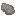 |
| - | Gravel Lump |  |
| - | Gravel Lump |  |
| - | Gravel Lump |  |

---
## Gray Concrete Capital
**ID Technique** : `terraqueous:gray_concrete_capital` | **Machine** : `minecraft:crafting_shaped`

| Emplacement | Ingrédient | Icône |
| :--- | :--- | :--- |
| # | Gray Concrete |  |

---
## Gray Concrete Column
**ID Technique** : `terraqueous:gray_concrete_column` | **Machine** : `minecraft:crafting_shaped`

| Emplacement | Ingrédient | Icône |
| :--- | :--- | :--- |
| # | Gray Concrete |  |

---
## Gray Concrete Edge
**ID Technique** : `terraqueous:gray_concrete_edge` | **Machine** : `minecraft:crafting_shaped`

| Emplacement | Ingrédient | Icône |
| :--- | :--- | :--- |
| @ | Gray Concrete Powder |  |
| # | Gray Concrete |  |

---
## Gray Dye
**ID Technique** : `minecraft:gray_dye` | **Machine** : `minecraft:crafting_shapeless`

| Emplacement | Ingrédient | Icône |
| :--- | :--- | :--- |
| - | Gray Ghost |  |

---
## Green Concrete Capital
**ID Technique** : `terraqueous:green_concrete_capital` | **Machine** : `minecraft:crafting_shaped`

| Emplacement | Ingrédient | Icône |
| :--- | :--- | :--- |
| # | Green Concrete |  |

---
## Green Concrete Column
**ID Technique** : `terraqueous:green_concrete_column` | **Machine** : `minecraft:crafting_shaped`

| Emplacement | Ingrédient | Icône |
| :--- | :--- | :--- |
| # | Green Concrete |  |

---
## Green Concrete Edge
**ID Technique** : `terraqueous:green_concrete_edge` | **Machine** : `minecraft:crafting_shaped`

| Emplacement | Ingrédient | Icône |
| :--- | :--- | :--- |
| @ | Green Concrete Powder |  |
| # | Green Concrete |  |

---
## Green Dye
**ID Technique** : `minecraft:green_dye` | **Machine** : `minecraft:crafting_shapeless`

| Emplacement | Ingrédient | Icône |
| :--- | :--- | :--- |
| - | Fern |  |

---
## Green Dye
**ID Technique** : `minecraft:green_dye` | **Machine** : `minecraft:smelting`

| Emplacement | Ingrédient | Icône |
| :--- | :--- | :--- |
| item | Cactus |  |

---
## Hammer
**ID Technique** : `terraqueous:hammer` | **Machine** : `minecraft:crafting_shaped`

| Emplacement | Ingrédient | Icône |
| :--- | :--- | :--- |
| I | Storage Blocks/Iron |  |
| L | Logs |  |

---
## Hay Block
**ID Technique** : `terraqueous:hay_block` | **Machine** : `minecraft:crafting_shaped`

| Emplacement | Ingrédient | Icône |
| :--- | :--- | :--- |
| # | Loose Hay |  |

---
## Iron Fence
**ID Technique** : `terraqueous:iron_fence` | **Machine** : `minecraft:crafting_shaped`

| Emplacement | Ingrédient | Icône |
| :--- | :--- | :--- |
| B | Dyes/Black |  |
| I | Ingots/Iron |  |
| N | Nuggets/Iron |  |

---
## Iron Garden Fence
**ID Technique** : `terraqueous:iron_garden_fence` | **Machine** : `minecraft:crafting_shaped`

| Emplacement | Ingrédient | Icône |
| :--- | :--- | :--- |
| B | Dyes/Black |  |
| I | Ingots/Iron |  |

---
## Iron Ingot
**ID Technique** : `minecraft:iron_ingot` | **Machine** : `minecraft:blasting`

| Emplacement | Ingrédient | Icône |
| :--- | :--- | :--- |
| item | Iron Dust |  |

---
## Iron Ingot
**ID Technique** : `minecraft:iron_ingot` | **Machine** : `minecraft:smelting`

| Emplacement | Ingrédient | Icône |
| :--- | :--- | :--- |
| item | Iron Dust |  |

---
## Large Flowerpot
**ID Technique** : `terraqueous:large_flowerpot` | **Machine** : `minecraft:crafting_shaped`

| Emplacement | Ingrédient | Icône |
| :--- | :--- | :--- |
| # | Ingots/Brick |  |

---
## Leather
**ID Technique** : `minecraft:leather` | **Machine** : `minecraft:crafting_shaped`

| Emplacement | Ingrédient | Icône |
| :--- | :--- | :--- |
| # | Leather Scraps | 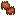 |

---
## Lemon Boat
**ID Technique** : `terraqueous:lemon_boat` | **Machine** : `minecraft:crafting_shaped`

| Emplacement | Ingrédient | Icône |
| :--- | :--- | :--- |
| # | Lemon Planks |  |

---
## Lemon Button
**ID Technique** : `terraqueous:lemon_button` | **Machine** : `minecraft:crafting_shapeless`

| Emplacement | Ingrédient | Icône |
| :--- | :--- | :--- |
| - | Lemon Planks |  |

---
## Lemon Chest Boat
**ID Technique** : `terraqueous:lemon_chest_boat` | **Machine** : `minecraft:crafting_shapeless`

| Emplacement | Ingrédient | Icône |
| :--- | :--- | :--- |
| - | Chests/Wooden |  |
| - | Lemon Boat | 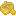 |

---
## Lemon Door
**ID Technique** : `terraqueous:lemon_door` | **Machine** : `minecraft:crafting_shaped`

| Emplacement | Ingrédient | Icône |
| :--- | :--- | :--- |
| # | Lemon Planks |  |

---
## Lemon Fence
**ID Technique** : `terraqueous:lemon_fence` | **Machine** : `minecraft:crafting_shaped`

| Emplacement | Ingrédient | Icône |
| :--- | :--- | :--- |
| # | Rods/Wooden |  |
| W | Lemon Planks |  |

---
## Lemon Fence Gate
**ID Technique** : `terraqueous:lemon_fence_gate` | **Machine** : `minecraft:crafting_shaped`

| Emplacement | Ingrédient | Icône |
| :--- | :--- | :--- |
| # | Rods/Wooden |  |
| W | Lemon Planks |  |

---
## Lemon Planks
**ID Technique** : `terraqueous:lemon_planks` | **Machine** : `minecraft:crafting_shapeless`

| Emplacement | Ingrédient | Icône |
| :--- | :--- | :--- |
| - | Lemon Logs |  |

---
## Lemon Pressure Plate
**ID Technique** : `terraqueous:lemon_pressure_plate` | **Machine** : `minecraft:crafting_shaped`

| Emplacement | Ingrédient | Icône |
| :--- | :--- | :--- |
| # | Lemon Planks |  |

---
## Lemon Sapling
**ID Technique** : `terraqueous:lemon_sapling` | **Machine** : `minecraft:crafting_shapeless`

| Emplacement | Ingrédient | Icône |
| :--- | :--- | :--- |
| - | Lemon |  |
| - | Lemon Leaves |  |
| - | Lemon Logs |  |

---
## Lemon Sign
**ID Technique** : `terraqueous:lemon_sign` | **Machine** : `minecraft:crafting_shaped`

| Emplacement | Ingrédient | Icône |
| :--- | :--- | :--- |
| # | Lemon Planks |  |
| X | Rods/Wooden |  |

---
## Lemon Slab
**ID Technique** : `terraqueous:lemon_slab` | **Machine** : `minecraft:crafting_shaped`

| Emplacement | Ingrédient | Icône |
| :--- | :--- | :--- |
| # | Lemon Planks |  |

---
## Lemon Stairs
**ID Technique** : `terraqueous:lemon_stairs` | **Machine** : `minecraft:crafting_shaped`

| Emplacement | Ingrédient | Icône |
| :--- | :--- | :--- |
| # | Lemon Planks |  |

---
## Lemon Trapdoor
**ID Technique** : `terraqueous:lemon_trapdoor` | **Machine** : `minecraft:crafting_shaped`

| Emplacement | Ingrédient | Icône |
| :--- | :--- | :--- |
| # | Lemon Planks |  |

---
## Lemon Wood
**ID Technique** : `terraqueous:lemon_wood` | **Machine** : `minecraft:crafting_shaped`

| Emplacement | Ingrédient | Icône |
| :--- | :--- | :--- |
| # | Lemon Log | 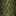 |

---
## Lifevine
**ID Technique** : `terraqueous:lifevine` | **Machine** : `minecraft:crafting_shapeless`

| Emplacement | Ingrédient | Icône |
| :--- | :--- | :--- |
| - | Vine |  |
| - | Lifefruit |  |

---
## Light Blue Concrete Capital
**ID Technique** : `terraqueous:light_blue_concrete_capital` | **Machine** : `minecraft:crafting_shaped`

| Emplacement | Ingrédient | Icône |
| :--- | :--- | :--- |
| # | Light Blue Concrete |  |

---
## Light Blue Concrete Column
**ID Technique** : `terraqueous:light_blue_concrete_column` | **Machine** : `minecraft:crafting_shaped`

| Emplacement | Ingrédient | Icône |
| :--- | :--- | :--- |
| # | Light Blue Concrete |  |

---
## Light Blue Concrete Edge
**ID Technique** : `terraqueous:light_blue_concrete_edge` | **Machine** : `minecraft:crafting_shaped`

| Emplacement | Ingrédient | Icône |
| :--- | :--- | :--- |
| @ | Light Blue Concrete Powder |  |
| # | Light Blue Concrete |  |

---
## Light Blue Dye
**ID Technique** : `minecraft:light_blue_dye` | **Machine** : `minecraft:crafting_shapeless`

| Emplacement | Ingrédient | Icône |
| :--- | :--- | :--- |
| - | Bluebell |  |

---
## Light Cloud
**ID Technique** : `terraqueous:light_cloud` | **Machine** : `minecraft:crafting_shaped`

| Emplacement | Ingrédient | Icône |
| :--- | :--- | :--- |
| # | Vapor Block |  |

---
## Light Cloud Button
**ID Technique** : `terraqueous:light_cloud_button` | **Machine** : `minecraft:crafting_shapeless`

| Emplacement | Ingrédient | Icône |
| :--- | :--- | :--- |
| - | Light Cloud |  |

---
## Light Cloud Capital
**ID Technique** : `terraqueous:light_cloud_capital` | **Machine** : `minecraft:crafting_shaped`

| Emplacement | Ingrédient | Icône |
| :--- | :--- | :--- |
| # | Light Cloud |  |

---
## Light Cloud Chest Raft
**ID Technique** : `terraqueous:light_cloud_chest_raft` | **Machine** : `minecraft:crafting_shapeless`

| Emplacement | Ingrédient | Icône |
| :--- | :--- | :--- |
| - | Chests/Wooden |  |
| - | Light Cloud Raft |  |

---
## Light Cloud Column
**ID Technique** : `terraqueous:light_cloud_column` | **Machine** : `minecraft:crafting_shaped`

| Emplacement | Ingrédient | Icône |
| :--- | :--- | :--- |
| # | Light Cloud |  |

---
## Light Cloud Door
**ID Technique** : `terraqueous:light_cloud_door` | **Machine** : `minecraft:crafting_shaped`

| Emplacement | Ingrédient | Icône |
| :--- | :--- | :--- |
| # | Light Cloud |  |

---
## Light Cloud Edge
**ID Technique** : `terraqueous:light_cloud_edge` | **Machine** : `minecraft:crafting_shaped`

| Emplacement | Ingrédient | Icône |
| :--- | :--- | :--- |
| @ | Vapor Block |  |
| # | Light Cloud |  |

---
## Light Cloud Fence
**ID Technique** : `terraqueous:light_cloud_fence` | **Machine** : `minecraft:crafting_shaped`

| Emplacement | Ingrédient | Icône |
| :--- | :--- | :--- |
| # | Vapor Block |  |
| W | Light Cloud |  |

---
## Light Cloud Fence Gate
**ID Technique** : `terraqueous:light_cloud_fence_gate` | **Machine** : `minecraft:crafting_shaped`

| Emplacement | Ingrédient | Icône |
| :--- | :--- | :--- |
| # | Vapor Block |  |
| W | Light Cloud |  |

---
## Light Cloud Pressure Plate
**ID Technique** : `terraqueous:light_cloud_pressure_plate` | **Machine** : `minecraft:crafting_shaped`

| Emplacement | Ingrédient | Icône |
| :--- | :--- | :--- |
| # | Light Cloud |  |

---
## Light Cloud Raft
**ID Technique** : `terraqueous:light_cloud_raft` | **Machine** : `minecraft:crafting_shaped`

| Emplacement | Ingrédient | Icône |
| :--- | :--- | :--- |
| # | Light Cloud |  |

---
## Light Cloud Sign
**ID Technique** : `terraqueous:light_cloud_sign` | **Machine** : `minecraft:crafting_shaped`

| Emplacement | Ingrédient | Icône |
| :--- | :--- | :--- |
| # | Light Cloud |  |
| X | Vapor Block |  |

---
## Light Cloud Slab
**ID Technique** : `terraqueous:light_cloud_slab` | **Machine** : `minecraft:crafting_shaped`

| Emplacement | Ingrédient | Icône |
| :--- | :--- | :--- |
| # | Light Cloud |  |

---
## Light Cloud Stairs
**ID Technique** : `terraqueous:light_cloud_stairs` | **Machine** : `minecraft:crafting_shaped`

| Emplacement | Ingrédient | Icône |
| :--- | :--- | :--- |
| # | Light Cloud |  |

---
## Light Cloud Trapdoor
**ID Technique** : `terraqueous:light_cloud_trapdoor` | **Machine** : `minecraft:crafting_shaped`

| Emplacement | Ingrédient | Icône |
| :--- | :--- | :--- |
| # | Light Cloud |  |

---
## Light Gray Concrete Capital
**ID Technique** : `terraqueous:light_gray_concrete_capital` | **Machine** : `minecraft:crafting_shaped`

| Emplacement | Ingrédient | Icône |
| :--- | :--- | :--- |
| # | Light Gray Concrete |  |

---
## Light Gray Concrete Column
**ID Technique** : `terraqueous:light_gray_concrete_column` | **Machine** : `minecraft:crafting_shaped`

| Emplacement | Ingrédient | Icône |
| :--- | :--- | :--- |
| # | Light Gray Concrete |  |

---
## Light Gray Concrete Edge
**ID Technique** : `terraqueous:light_gray_concrete_edge` | **Machine** : `minecraft:crafting_shaped`

| Emplacement | Ingrédient | Icône |
| :--- | :--- | :--- |
| @ | Light Gray Concrete Powder |  |
| # | Light Gray Concrete |  |

---
## Light Gray Dye
**ID Technique** : `minecraft:light_gray_dye` | **Machine** : `minecraft:crafting_shapeless`

| Emplacement | Ingrédient | Icône |
| :--- | :--- | :--- |
| - | Ghost Plant |  |

---
## Lime Concrete Capital
**ID Technique** : `terraqueous:lime_concrete_capital` | **Machine** : `minecraft:crafting_shaped`

| Emplacement | Ingrédient | Icône |
| :--- | :--- | :--- |
| # | Lime Concrete |  |

---
## Lime Concrete Column
**ID Technique** : `terraqueous:lime_concrete_column` | **Machine** : `minecraft:crafting_shaped`

| Emplacement | Ingrédient | Icône |
| :--- | :--- | :--- |
| # | Lime Concrete |  |

---
## Lime Concrete Edge
**ID Technique** : `terraqueous:lime_concrete_edge` | **Machine** : `minecraft:crafting_shaped`

| Emplacement | Ingrédient | Icône |
| :--- | :--- | :--- |
| @ | Lime Concrete Powder |  |
| # | Lime Concrete |  |

---
## Lime Dye
**ID Technique** : `minecraft:lime_dye` | **Machine** : `minecraft:crafting_shapeless`

| Emplacement | Ingrédient | Icône |
| :--- | :--- | :--- |
| - | Little Lime Hydrangea |  |

---
## Loose Hay
**ID Technique** : `terraqueous:loose_hay` | **Machine** : `minecraft:crafting_shapeless`

| Emplacement | Ingrédient | Icône |
| :--- | :--- | :--- |
| - | Hay Block |  |

---
## Loose Hay
**ID Technique** : `terraqueous:loose_hay` | **Machine** : `minecraft:crafting_shapeless`

| Emplacement | Ingrédient | Icône |
| :--- | :--- | :--- |
| - | Thresh |  |

---
## Magenta Concrete Capital
**ID Technique** : `terraqueous:magenta_concrete_capital` | **Machine** : `minecraft:crafting_shaped`

| Emplacement | Ingrédient | Icône |
| :--- | :--- | :--- |
| # | Magenta Concrete |  |

---
## Magenta Concrete Column
**ID Technique** : `terraqueous:magenta_concrete_column` | **Machine** : `minecraft:crafting_shaped`

| Emplacement | Ingrédient | Icône |
| :--- | :--- | :--- |
| # | Magenta Concrete |  |

---
## Magenta Concrete Edge
**ID Technique** : `terraqueous:magenta_concrete_edge` | **Machine** : `minecraft:crafting_shaped`

| Emplacement | Ingrédient | Icône |
| :--- | :--- | :--- |
| @ | Magenta Concrete Powder |  |
| # | Magenta Concrete |  |

---
## Magenta Dye
**ID Technique** : `minecraft:magenta_dye` | **Machine** : `minecraft:crafting_shapeless`

| Emplacement | Ingrédient | Icône |
| :--- | :--- | :--- |
| - | Primrose |  |

---
## Mango Boat
**ID Technique** : `terraqueous:mango_boat` | **Machine** : `minecraft:crafting_shaped`

| Emplacement | Ingrédient | Icône |
| :--- | :--- | :--- |
| # | Mango Planks |  |

---
## Mango Button
**ID Technique** : `terraqueous:mango_button` | **Machine** : `minecraft:crafting_shapeless`

| Emplacement | Ingrédient | Icône |
| :--- | :--- | :--- |
| - | Mango Planks |  |

---
## Mango Chest Boat
**ID Technique** : `terraqueous:mango_chest_boat` | **Machine** : `minecraft:crafting_shapeless`

| Emplacement | Ingrédient | Icône |
| :--- | :--- | :--- |
| - | Chests/Wooden |  |
| - | Mango Boat | 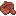 |

---
## Mango Door
**ID Technique** : `terraqueous:mango_door` | **Machine** : `minecraft:crafting_shaped`

| Emplacement | Ingrédient | Icône |
| :--- | :--- | :--- |
| # | Mango Planks |  |

---
## Mango Fence
**ID Technique** : `terraqueous:mango_fence` | **Machine** : `minecraft:crafting_shaped`

| Emplacement | Ingrédient | Icône |
| :--- | :--- | :--- |
| # | Rods/Wooden |  |
| W | Mango Planks |  |

---
## Mango Fence Gate
**ID Technique** : `terraqueous:mango_fence_gate` | **Machine** : `minecraft:crafting_shaped`

| Emplacement | Ingrédient | Icône |
| :--- | :--- | :--- |
| # | Rods/Wooden |  |
| W | Mango Planks |  |

---
## Mango Planks
**ID Technique** : `terraqueous:mango_planks` | **Machine** : `minecraft:crafting_shapeless`

| Emplacement | Ingrédient | Icône |
| :--- | :--- | :--- |
| - | Mango Logs |  |

---
## Mango Pressure Plate
**ID Technique** : `terraqueous:mango_pressure_plate` | **Machine** : `minecraft:crafting_shaped`

| Emplacement | Ingrédient | Icône |
| :--- | :--- | :--- |
| # | Mango Planks |  |

---
## Mango Sapling
**ID Technique** : `terraqueous:mango_sapling` | **Machine** : `minecraft:crafting_shapeless`

| Emplacement | Ingrédient | Icône |
| :--- | :--- | :--- |
| - | Mango |  |
| - | Mango Leaves | 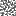 |
| - | Mango Logs |  |

---
## Mango Sign
**ID Technique** : `terraqueous:mango_sign` | **Machine** : `minecraft:crafting_shaped`

| Emplacement | Ingrédient | Icône |
| :--- | :--- | :--- |
| # | Mango Planks |  |
| X | Rods/Wooden |  |

---
## Mango Slab
**ID Technique** : `terraqueous:mango_slab` | **Machine** : `minecraft:crafting_shaped`

| Emplacement | Ingrédient | Icône |
| :--- | :--- | :--- |
| # | Mango Planks |  |

---
## Mango Stairs
**ID Technique** : `terraqueous:mango_stairs` | **Machine** : `minecraft:crafting_shaped`

| Emplacement | Ingrédient | Icône |
| :--- | :--- | :--- |
| # | Mango Planks |  |

---
## Mango Trapdoor
**ID Technique** : `terraqueous:mango_trapdoor` | **Machine** : `minecraft:crafting_shaped`

| Emplacement | Ingrédient | Icône |
| :--- | :--- | :--- |
| # | Mango Planks |  |

---
## Mango Wood
**ID Technique** : `terraqueous:mango_wood` | **Machine** : `minecraft:crafting_shaped`

| Emplacement | Ingrédient | Icône |
| :--- | :--- | :--- |
| # | Mango Log | 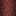 |

---
## Medium Flowerpot
**ID Technique** : `terraqueous:medium_flowerpot` | **Machine** : `minecraft:crafting_shaped`

| Emplacement | Ingrédient | Icône |
| :--- | :--- | :--- |
| # | Ingots/Brick |  |

---
## Mitred Burnium Block
**ID Technique** : `terraqueous:mitred_burnium_block` | **Machine** : `minecraft:crafting_shaped`

| Emplacement | Ingrédient | Icône |
| :--- | :--- | :--- |
| # | Burnium Blocks |  |

---
## Mitred Endimium Block
**ID Technique** : `terraqueous:mitred_endimium_block` | **Machine** : `minecraft:crafting_shaped`

| Emplacement | Ingrédient | Icône |
| :--- | :--- | :--- |
| # | Endimium Blocks |  |

---
## Mulberry Boat
**ID Technique** : `terraqueous:mulberry_boat` | **Machine** : `minecraft:crafting_shaped`

| Emplacement | Ingrédient | Icône |
| :--- | :--- | :--- |
| # | Mulberry Planks |  |

---
## Mulberry Button
**ID Technique** : `terraqueous:mulberry_button` | **Machine** : `minecraft:crafting_shapeless`

| Emplacement | Ingrédient | Icône |
| :--- | :--- | :--- |
| - | Mulberry Planks |  |

---
## Mulberry Chest Boat
**ID Technique** : `terraqueous:mulberry_chest_boat` | **Machine** : `minecraft:crafting_shapeless`

| Emplacement | Ingrédient | Icône |
| :--- | :--- | :--- |
| - | Chests/Wooden |  |
| - | Mulberry Boat |  |

---
## Mulberry Door
**ID Technique** : `terraqueous:mulberry_door` | **Machine** : `minecraft:crafting_shaped`

| Emplacement | Ingrédient | Icône |
| :--- | :--- | :--- |
| # | Mulberry Planks |  |

---
## Mulberry Fence
**ID Technique** : `terraqueous:mulberry_fence` | **Machine** : `minecraft:crafting_shaped`

| Emplacement | Ingrédient | Icône |
| :--- | :--- | :--- |
| # | Rods/Wooden |  |
| W | Mulberry Planks |  |

---
## Mulberry Fence Gate
**ID Technique** : `terraqueous:mulberry_fence_gate` | **Machine** : `minecraft:crafting_shaped`

| Emplacement | Ingrédient | Icône |
| :--- | :--- | :--- |
| # | Rods/Wooden |  |
| W | Mulberry Planks |  |

---
## Mulberry Planks
**ID Technique** : `terraqueous:mulberry_planks` | **Machine** : `minecraft:crafting_shapeless`

| Emplacement | Ingrédient | Icône |
| :--- | :--- | :--- |
| - | Mulberry Logs |  |

---
## Mulberry Pressure Plate
**ID Technique** : `terraqueous:mulberry_pressure_plate` | **Machine** : `minecraft:crafting_shaped`

| Emplacement | Ingrédient | Icône |
| :--- | :--- | :--- |
| # | Mulberry Planks |  |

---
## Mulberry Sapling
**ID Technique** : `terraqueous:mulberry_sapling` | **Machine** : `minecraft:crafting_shapeless`

| Emplacement | Ingrédient | Icône |
| :--- | :--- | :--- |
| - | Mulberry |  |
| - | Mulberry Leaves | 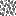 |
| - | Mulberry Logs |  |

---
## Mulberry Sign
**ID Technique** : `terraqueous:mulberry_sign` | **Machine** : `minecraft:crafting_shaped`

| Emplacement | Ingrédient | Icône |
| :--- | :--- | :--- |
| # | Mulberry Planks |  |
| X | Rods/Wooden |  |

---
## Mulberry Slab
**ID Technique** : `terraqueous:mulberry_slab` | **Machine** : `minecraft:crafting_shaped`

| Emplacement | Ingrédient | Icône |
| :--- | :--- | :--- |
| # | Mulberry Planks |  |

---
## Mulberry Stairs
**ID Technique** : `terraqueous:mulberry_stairs` | **Machine** : `minecraft:crafting_shaped`

| Emplacement | Ingrédient | Icône |
| :--- | :--- | :--- |
| # | Mulberry Planks |  |

---
## Mulberry Trapdoor
**ID Technique** : `terraqueous:mulberry_trapdoor` | **Machine** : `minecraft:crafting_shaped`

| Emplacement | Ingrédient | Icône |
| :--- | :--- | :--- |
| # | Mulberry Planks |  |

---
## Mulberry Wood
**ID Technique** : `terraqueous:mulberry_wood` | **Machine** : `minecraft:crafting_shaped`

| Emplacement | Ingrédient | Icône |
| :--- | :--- | :--- |
| # | Mulberry Log |  |

---
## Multitool
**ID Technique** : `terraqueous:multitool` | **Machine** : `minecraft:crafting_shaped`

| Emplacement | Ingrédient | Icône |
| :--- | :--- | :--- |
| I | Storage Blocks/Iron |  |
| L | Logs |  |
| B | Burnium |  |
| E | Endimium |  |

---
## Orange Boat
**ID Technique** : `terraqueous:orange_boat` | **Machine** : `minecraft:crafting_shaped`

| Emplacement | Ingrédient | Icône |
| :--- | :--- | :--- |
| # | Orange Planks |  |

---
## Orange Button
**ID Technique** : `terraqueous:orange_button` | **Machine** : `minecraft:crafting_shapeless`

| Emplacement | Ingrédient | Icône |
| :--- | :--- | :--- |
| - | Orange Planks |  |

---
## Orange Chest Boat
**ID Technique** : `terraqueous:orange_chest_boat` | **Machine** : `minecraft:crafting_shapeless`

| Emplacement | Ingrédient | Icône |
| :--- | :--- | :--- |
| - | Chests/Wooden |  |
| - | Orange Boat | 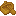 |

---
## Orange Concrete Capital
**ID Technique** : `terraqueous:orange_concrete_capital` | **Machine** : `minecraft:crafting_shaped`

| Emplacement | Ingrédient | Icône |
| :--- | :--- | :--- |
| # | Orange Concrete |  |

---
## Orange Concrete Column
**ID Technique** : `terraqueous:orange_concrete_column` | **Machine** : `minecraft:crafting_shaped`

| Emplacement | Ingrédient | Icône |
| :--- | :--- | :--- |
| # | Orange Concrete |  |

---
## Orange Concrete Edge
**ID Technique** : `terraqueous:orange_concrete_edge` | **Machine** : `minecraft:crafting_shaped`

| Emplacement | Ingrédient | Icône |
| :--- | :--- | :--- |
| @ | Orange Concrete Powder |  |
| # | Orange Concrete |  |

---
## Orange Door
**ID Technique** : `terraqueous:orange_door` | **Machine** : `minecraft:crafting_shaped`

| Emplacement | Ingrédient | Icône |
| :--- | :--- | :--- |
| # | Orange Planks |  |

---
## Orange Dye
**ID Technique** : `minecraft:orange_dye` | **Machine** : `minecraft:crafting_shapeless`

| Emplacement | Ingrédient | Icône |
| :--- | :--- | :--- |
| - | Marigold |  |

---
## Orange Fence
**ID Technique** : `terraqueous:orange_fence` | **Machine** : `minecraft:crafting_shaped`

| Emplacement | Ingrédient | Icône |
| :--- | :--- | :--- |
| # | Rods/Wooden |  |
| W | Orange Planks |  |

---
## Orange Fence Gate
**ID Technique** : `terraqueous:orange_fence_gate` | **Machine** : `minecraft:crafting_shaped`

| Emplacement | Ingrédient | Icône |
| :--- | :--- | :--- |
| # | Rods/Wooden |  |
| W | Orange Planks |  |

---
## Orange Planks
**ID Technique** : `terraqueous:orange_planks` | **Machine** : `minecraft:crafting_shapeless`

| Emplacement | Ingrédient | Icône |
| :--- | :--- | :--- |
| - | Orange Logs |  |

---
## Orange Pressure Plate
**ID Technique** : `terraqueous:orange_pressure_plate` | **Machine** : `minecraft:crafting_shaped`

| Emplacement | Ingrédient | Icône |
| :--- | :--- | :--- |
| # | Orange Planks |  |

---
## Orange Sapling
**ID Technique** : `terraqueous:orange_sapling` | **Machine** : `minecraft:crafting_shapeless`

| Emplacement | Ingrédient | Icône |
| :--- | :--- | :--- |
| - | Orange |  |
| - | Orange Leaves |  |
| - | Orange Logs |  |

---
## Orange Sign
**ID Technique** : `terraqueous:orange_sign` | **Machine** : `minecraft:crafting_shaped`

| Emplacement | Ingrédient | Icône |
| :--- | :--- | :--- |
| # | Orange Planks |  |
| X | Rods/Wooden |  |

---
## Orange Slab
**ID Technique** : `terraqueous:orange_slab` | **Machine** : `minecraft:crafting_shaped`

| Emplacement | Ingrédient | Icône |
| :--- | :--- | :--- |
| # | Orange Planks |  |

---
## Orange Stairs
**ID Technique** : `terraqueous:orange_stairs` | **Machine** : `minecraft:crafting_shaped`

| Emplacement | Ingrédient | Icône |
| :--- | :--- | :--- |
| # | Orange Planks |  |

---
## Orange Trapdoor
**ID Technique** : `terraqueous:orange_trapdoor` | **Machine** : `minecraft:crafting_shaped`

| Emplacement | Ingrédient | Icône |
| :--- | :--- | :--- |
| # | Orange Planks |  |

---
## Orange Wood
**ID Technique** : `terraqueous:orange_wood` | **Machine** : `minecraft:crafting_shaped`

| Emplacement | Ingrédient | Icône |
| :--- | :--- | :--- |
| # | Orange Log | 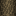 |

---
## Paper Block
**ID Technique** : `terraqueous:paper_block` | **Machine** : `minecraft:crafting_shaped`

| Emplacement | Ingrédient | Icône |
| :--- | :--- | :--- |
| # | Paper |  |

---
## Paper
**ID Technique** : `minecraft:paper` | **Machine** : `minecraft:crafting_shapeless`

| Emplacement | Ingrédient | Icône |
| :--- | :--- | :--- |
| - | Paper Block |  |

---
## Paper Lantern
**ID Technique** : `terraqueous:paper_lantern` | **Machine** : `minecraft:crafting_shaped`

| Emplacement | Ingrédient | Icône |
| :--- | :--- | :--- |
| S | Rods/Wooden |  |
| P | Paper |  |
| T | Torch |  |

---
## Peach Boat
**ID Technique** : `terraqueous:peach_boat` | **Machine** : `minecraft:crafting_shaped`

| Emplacement | Ingrédient | Icône |
| :--- | :--- | :--- |
| # | Peach Planks |  |

---
## Peach Button
**ID Technique** : `terraqueous:peach_button` | **Machine** : `minecraft:crafting_shapeless`

| Emplacement | Ingrédient | Icône |
| :--- | :--- | :--- |
| - | Peach Planks |  |

---
## Peach Chest Boat
**ID Technique** : `terraqueous:peach_chest_boat` | **Machine** : `minecraft:crafting_shapeless`

| Emplacement | Ingrédient | Icône |
| :--- | :--- | :--- |
| - | Chests/Wooden |  |
| - | Peach Boat |  |

---
## Peach Door
**ID Technique** : `terraqueous:peach_door` | **Machine** : `minecraft:crafting_shaped`

| Emplacement | Ingrédient | Icône |
| :--- | :--- | :--- |
| # | Peach Planks |  |

---
## Peach Fence
**ID Technique** : `terraqueous:peach_fence` | **Machine** : `minecraft:crafting_shaped`

| Emplacement | Ingrédient | Icône |
| :--- | :--- | :--- |
| # | Rods/Wooden |  |
| W | Peach Planks |  |

---
## Peach Fence Gate
**ID Technique** : `terraqueous:peach_fence_gate` | **Machine** : `minecraft:crafting_shaped`

| Emplacement | Ingrédient | Icône |
| :--- | :--- | :--- |
| # | Rods/Wooden |  |
| W | Peach Planks |  |

---
## Peach Planks
**ID Technique** : `terraqueous:peach_planks` | **Machine** : `minecraft:crafting_shapeless`

| Emplacement | Ingrédient | Icône |
| :--- | :--- | :--- |
| - | Peach Logs |  |

---
## Peach Pressure Plate
**ID Technique** : `terraqueous:peach_pressure_plate` | **Machine** : `minecraft:crafting_shaped`

| Emplacement | Ingrédient | Icône |
| :--- | :--- | :--- |
| # | Peach Planks |  |

---
## Peach Sapling
**ID Technique** : `terraqueous:peach_sapling` | **Machine** : `minecraft:crafting_shapeless`

| Emplacement | Ingrédient | Icône |
| :--- | :--- | :--- |
| - | Peach |  |
| - | Peach Leaves |  |
| - | Peach Logs |  |

---
## Peach Sign
**ID Technique** : `terraqueous:peach_sign` | **Machine** : `minecraft:crafting_shaped`

| Emplacement | Ingrédient | Icône |
| :--- | :--- | :--- |
| # | Peach Planks |  |
| X | Rods/Wooden |  |

---
## Peach Slab
**ID Technique** : `terraqueous:peach_slab` | **Machine** : `minecraft:crafting_shaped`

| Emplacement | Ingrédient | Icône |
| :--- | :--- | :--- |
| # | Peach Planks |  |

---
## Peach Stairs
**ID Technique** : `terraqueous:peach_stairs` | **Machine** : `minecraft:crafting_shaped`

| Emplacement | Ingrédient | Icône |
| :--- | :--- | :--- |
| # | Peach Planks |  |

---
## Peach Trapdoor
**ID Technique** : `terraqueous:peach_trapdoor` | **Machine** : `minecraft:crafting_shaped`

| Emplacement | Ingrédient | Icône |
| :--- | :--- | :--- |
| # | Peach Planks |  |

---
## Peach Wood
**ID Technique** : `terraqueous:peach_wood` | **Machine** : `minecraft:crafting_shaped`

| Emplacement | Ingrédient | Icône |
| :--- | :--- | :--- |
| # | Peach Log |  |

---
## Pear Boat
**ID Technique** : `terraqueous:pear_boat` | **Machine** : `minecraft:crafting_shaped`

| Emplacement | Ingrédient | Icône |
| :--- | :--- | :--- |
| # | Pear Planks |  |

---
## Pear Button
**ID Technique** : `terraqueous:pear_button` | **Machine** : `minecraft:crafting_shapeless`

| Emplacement | Ingrédient | Icône |
| :--- | :--- | :--- |
| - | Pear Planks |  |

---
## Pear Chest Boat
**ID Technique** : `terraqueous:pear_chest_boat` | **Machine** : `minecraft:crafting_shapeless`

| Emplacement | Ingrédient | Icône |
| :--- | :--- | :--- |
| - | Chests/Wooden |  |
| - | Pear Boat | 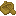 |

---
## Pear Door
**ID Technique** : `terraqueous:pear_door` | **Machine** : `minecraft:crafting_shaped`

| Emplacement | Ingrédient | Icône |
| :--- | :--- | :--- |
| # | Pear Planks |  |

---
## Pear Fence
**ID Technique** : `terraqueous:pear_fence` | **Machine** : `minecraft:crafting_shaped`

| Emplacement | Ingrédient | Icône |
| :--- | :--- | :--- |
| # | Rods/Wooden |  |
| W | Pear Planks |  |

---
## Pear Fence Gate
**ID Technique** : `terraqueous:pear_fence_gate` | **Machine** : `minecraft:crafting_shaped`

| Emplacement | Ingrédient | Icône |
| :--- | :--- | :--- |
| # | Rods/Wooden |  |
| W | Pear Planks |  |

---
## Pear Planks
**ID Technique** : `terraqueous:pear_planks` | **Machine** : `minecraft:crafting_shapeless`

| Emplacement | Ingrédient | Icône |
| :--- | :--- | :--- |
| - | Pear Logs |  |

---
## Pear Pressure Plate
**ID Technique** : `terraqueous:pear_pressure_plate` | **Machine** : `minecraft:crafting_shaped`

| Emplacement | Ingrédient | Icône |
| :--- | :--- | :--- |
| # | Pear Planks |  |

---
## Pear Sapling
**ID Technique** : `terraqueous:pear_sapling` | **Machine** : `minecraft:crafting_shapeless`

| Emplacement | Ingrédient | Icône |
| :--- | :--- | :--- |
| - | Pear | 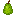 |
| - | Pear Leaves | 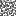 |
| - | Pear Logs |  |

---
## Pear Sign
**ID Technique** : `terraqueous:pear_sign` | **Machine** : `minecraft:crafting_shaped`

| Emplacement | Ingrédient | Icône |
| :--- | :--- | :--- |
| # | Pear Planks |  |
| X | Rods/Wooden |  |

---
## Pear Slab
**ID Technique** : `terraqueous:pear_slab` | **Machine** : `minecraft:crafting_shaped`

| Emplacement | Ingrédient | Icône |
| :--- | :--- | :--- |
| # | Pear Planks |  |

---
## Pear Stairs
**ID Technique** : `terraqueous:pear_stairs` | **Machine** : `minecraft:crafting_shaped`

| Emplacement | Ingrédient | Icône |
| :--- | :--- | :--- |
| # | Pear Planks |  |

---
## Pear Trapdoor
**ID Technique** : `terraqueous:pear_trapdoor` | **Machine** : `minecraft:crafting_shaped`

| Emplacement | Ingrédient | Icône |
| :--- | :--- | :--- |
| # | Pear Planks |  |

---
## Pear Wood
**ID Technique** : `terraqueous:pear_wood` | **Machine** : `minecraft:crafting_shaped`

| Emplacement | Ingrédient | Icône |
| :--- | :--- | :--- |
| # | Pear Log | 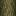 |

---
## Pergola Gate
**ID Technique** : `terraqueous:pergola_gate` | **Machine** : `minecraft:crafting_shaped`

| Emplacement | Ingrédient | Icône |
| :--- | :--- | :--- |
| S | Rods/Wooden |  |
| H | Wooden Slabs |  |
| P | Planks |  |

---
## Pergola Roof
**ID Technique** : `terraqueous:pergola_roof` | **Machine** : `minecraft:crafting_shaped`

| Emplacement | Ingrédient | Icône |
| :--- | :--- | :--- |
| S | Rods/Wooden |  |
| H | Wooden Slabs |  |
| P | Planks |  |

---
## Pergola Wall
**ID Technique** : `terraqueous:pergola_wall` | **Machine** : `minecraft:crafting_shaped`

| Emplacement | Ingrédient | Icône |
| :--- | :--- | :--- |
| S | Rods/Wooden |  |
| H | Wooden Slabs |  |
| P | Planks |  |

---
## Picket Fence
**ID Technique** : `terraqueous:picket_fence` | **Machine** : `minecraft:crafting_shaped`

| Emplacement | Ingrédient | Icône |
| :--- | :--- | :--- |
| W | Dyes/White |  |
| F | Fences/Wooden |  |
| S | Rods/Wooden |  |

---
## Picket Garden Fence
**ID Technique** : `terraqueous:picket_garden_fence` | **Machine** : `minecraft:crafting_shaped`

| Emplacement | Ingrédient | Icône |
| :--- | :--- | :--- |
| W | Dyes/White |  |
| F | Fences/Wooden |  |

---
## Pink Concrete Capital
**ID Technique** : `terraqueous:pink_concrete_capital` | **Machine** : `minecraft:crafting_shaped`

| Emplacement | Ingrédient | Icône |
| :--- | :--- | :--- |
| # | Pink Concrete |  |

---
## Pink Concrete Column
**ID Technique** : `terraqueous:pink_concrete_column` | **Machine** : `minecraft:crafting_shaped`

| Emplacement | Ingrédient | Icône |
| :--- | :--- | :--- |
| # | Pink Concrete |  |

---
## Pink Concrete Edge
**ID Technique** : `terraqueous:pink_concrete_edge` | **Machine** : `minecraft:crafting_shaped`

| Emplacement | Ingrédient | Icône |
| :--- | :--- | :--- |
| @ | Pink Concrete Powder |  |
| # | Pink Concrete |  |

---
## Pink Dye
**ID Technique** : `minecraft:pink_dye` | **Machine** : `minecraft:crafting_shapeless`

| Emplacement | Ingrédient | Icône |
| :--- | :--- | :--- |
| - | Rose |  |

---
## Planter
**ID Technique** : `terraqueous:planter` | **Machine** : `minecraft:crafting_shaped`

| Emplacement | Ingrédient | Icône |
| :--- | :--- | :--- |
| # | Ingots/Brick |  |

---
## Plum Boat
**ID Technique** : `terraqueous:plum_boat` | **Machine** : `minecraft:crafting_shaped`

| Emplacement | Ingrédient | Icône |
| :--- | :--- | :--- |
| # | Plum Planks |  |

---
## Plum Button
**ID Technique** : `terraqueous:plum_button` | **Machine** : `minecraft:crafting_shapeless`

| Emplacement | Ingrédient | Icône |
| :--- | :--- | :--- |
| - | Plum Planks |  |

---
## Plum Chest Boat
**ID Technique** : `terraqueous:plum_chest_boat` | **Machine** : `minecraft:crafting_shapeless`

| Emplacement | Ingrédient | Icône |
| :--- | :--- | :--- |
| - | Chests/Wooden |  |
| - | Plum Boat | 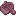 |

---
## Plum Door
**ID Technique** : `terraqueous:plum_door` | **Machine** : `minecraft:crafting_shaped`

| Emplacement | Ingrédient | Icône |
| :--- | :--- | :--- |
| # | Plum Planks |  |

---
## Plum Fence
**ID Technique** : `terraqueous:plum_fence` | **Machine** : `minecraft:crafting_shaped`

| Emplacement | Ingrédient | Icône |
| :--- | :--- | :--- |
| # | Rods/Wooden |  |
| W | Plum Planks |  |

---
## Plum Fence Gate
**ID Technique** : `terraqueous:plum_fence_gate` | **Machine** : `minecraft:crafting_shaped`

| Emplacement | Ingrédient | Icône |
| :--- | :--- | :--- |
| # | Rods/Wooden |  |
| W | Plum Planks |  |

---
## Plum Planks
**ID Technique** : `terraqueous:plum_planks` | **Machine** : `minecraft:crafting_shapeless`

| Emplacement | Ingrédient | Icône |
| :--- | :--- | :--- |
| - | Plum Logs |  |

---
## Plum Pressure Plate
**ID Technique** : `terraqueous:plum_pressure_plate` | **Machine** : `minecraft:crafting_shaped`

| Emplacement | Ingrédient | Icône |
| :--- | :--- | :--- |
| # | Plum Planks |  |

---
## Plum Sapling
**ID Technique** : `terraqueous:plum_sapling` | **Machine** : `minecraft:crafting_shapeless`

| Emplacement | Ingrédient | Icône |
| :--- | :--- | :--- |
| - | Plum |  |
| - | Plum Leaves | 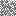 |
| - | Plum Logs |  |

---
## Plum Sign
**ID Technique** : `terraqueous:plum_sign` | **Machine** : `minecraft:crafting_shaped`

| Emplacement | Ingrédient | Icône |
| :--- | :--- | :--- |
| # | Plum Planks |  |
| X | Rods/Wooden |  |

---
## Plum Slab
**ID Technique** : `terraqueous:plum_slab` | **Machine** : `minecraft:crafting_shaped`

| Emplacement | Ingrédient | Icône |
| :--- | :--- | :--- |
| # | Plum Planks |  |

---
## Plum Stairs
**ID Technique** : `terraqueous:plum_stairs` | **Machine** : `minecraft:crafting_shaped`

| Emplacement | Ingrédient | Icône |
| :--- | :--- | :--- |
| # | Plum Planks |  |

---
## Plum Trapdoor
**ID Technique** : `terraqueous:plum_trapdoor` | **Machine** : `minecraft:crafting_shaped`

| Emplacement | Ingrédient | Icône |
| :--- | :--- | :--- |
| # | Plum Planks |  |

---
## Plum Wood
**ID Technique** : `terraqueous:plum_wood` | **Machine** : `minecraft:crafting_shaped`

| Emplacement | Ingrédient | Icône |
| :--- | :--- | :--- |
| # | Plum Log | 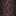 |

---
## Purple Concrete Capital
**ID Technique** : `terraqueous:purple_concrete_capital` | **Machine** : `minecraft:crafting_shaped`

| Emplacement | Ingrédient | Icône |
| :--- | :--- | :--- |
| # | Purple Concrete |  |

---
## Purple Concrete Column
**ID Technique** : `terraqueous:purple_concrete_column` | **Machine** : `minecraft:crafting_shaped`

| Emplacement | Ingrédient | Icône |
| :--- | :--- | :--- |
| # | Purple Concrete |  |

---
## Purple Concrete Edge
**ID Technique** : `terraqueous:purple_concrete_edge` | **Machine** : `minecraft:crafting_shaped`

| Emplacement | Ingrédient | Icône |
| :--- | :--- | :--- |
| @ | Purple Concrete Powder |  |
| # | Purple Concrete |  |

---
## Purple Dye
**ID Technique** : `minecraft:purple_dye` | **Machine** : `minecraft:crafting_shapeless`

| Emplacement | Ingrédient | Icône |
| :--- | :--- | :--- |
| - | Lavender |  |

---
## Red Concrete Capital
**ID Technique** : `terraqueous:red_concrete_capital` | **Machine** : `minecraft:crafting_shaped`

| Emplacement | Ingrédient | Icône |
| :--- | :--- | :--- |
| # | Red Concrete |  |

---
## Red Concrete Column
**ID Technique** : `terraqueous:red_concrete_column` | **Machine** : `minecraft:crafting_shaped`

| Emplacement | Ingrédient | Icône |
| :--- | :--- | :--- |
| # | Red Concrete |  |

---
## Red Concrete Edge
**ID Technique** : `terraqueous:red_concrete_edge` | **Machine** : `minecraft:crafting_shaped`

| Emplacement | Ingrédient | Icône |
| :--- | :--- | :--- |
| @ | Red Concrete Powder |  |
| # | Red Concrete |  |

---
## Red Dye
**ID Technique** : `minecraft:red_dye` | **Machine** : `minecraft:crafting_shapeless`

| Emplacement | Ingrédient | Icône |
| :--- | :--- | :--- |
| - | Carnation |  |

---
## Red Sandstone
**ID Technique** : `minecraft:red_sandstone` | **Machine** : `minecraft:crafting_shapeless`

| Emplacement | Ingrédient | Icône |
| :--- | :--- | :--- |
| - | Red Sandstone Lump | 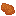 |
| - | Red Sandstone Lump |  |
| - | Red Sandstone Lump |  |
| - | Red Sandstone Lump |  |

---
## Sandstone
**ID Technique** : `minecraft:sandstone` | **Machine** : `minecraft:crafting_shapeless`

| Emplacement | Ingrédient | Icône |
| :--- | :--- | :--- |
| - | Sandstone Lump | 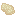 |
| - | Sandstone Lump |  |
| - | Sandstone Lump |  |
| - | Sandstone Lump |  |

---
## Scythe
**ID Technique** : `terraqueous:scythe` | **Machine** : `minecraft:crafting_shaped`

| Emplacement | Ingrédient | Icône |
| :--- | :--- | :--- |
| I | Ingots/Iron |  |
| S | Rods/Wooden |  |
| C | String |  |

---
## Small Flowerpot
**ID Technique** : `terraqueous:small_flowerpot` | **Machine** : `minecraft:crafting_shaped`

| Emplacement | Ingrédient | Icône |
| :--- | :--- | :--- |
| # | Ingots/Brick |  |

---
## Small Flowerpot
**ID Technique** : `terraqueous:small_flowerpot` | **Machine** : `minecraft:crafting_shapeless`

| Emplacement | Ingrédient | Icône |
| :--- | :--- | :--- |
| - | Flower Pot |  |

---
## Smooth Burnium Block
**ID Technique** : `terraqueous:smooth_burnium_block` | **Machine** : `minecraft:crafting_shaped`

| Emplacement | Ingrédient | Icône |
| :--- | :--- | :--- |
| # | Burnium Blocks |  |

---
## Smooth Endimium Block
**ID Technique** : `terraqueous:smooth_endimium_block` | **Machine** : `minecraft:crafting_shaped`

| Emplacement | Ingrédient | Icône |
| :--- | :--- | :--- |
| # | Endimium Blocks |  |

---
## Speed Strip
**ID Technique** : `terraqueous:speed_strip` | **Machine** : `minecraft:crafting_shaped`

| Emplacement | Ingrédient | Icône |
| :--- | :--- | :--- |
| R | Dusts/Redstone |  |
| G | Ingots/Gold |  |

---
## Storm Cloud
**ID Technique** : `terraqueous:storm_cloud` | **Machine** : `minecraft:crafting_shaped`

| Emplacement | Ingrédient | Icône |
| :--- | :--- | :--- |
| # | Dense Cloud |  |

---
## Storm Cloud Button
**ID Technique** : `terraqueous:storm_cloud_button` | **Machine** : `minecraft:crafting_shapeless`

| Emplacement | Ingrédient | Icône |
| :--- | :--- | :--- |
| - | Storm Cloud |  |

---
## Storm Cloud Capital
**ID Technique** : `terraqueous:storm_cloud_capital` | **Machine** : `minecraft:crafting_shaped`

| Emplacement | Ingrédient | Icône |
| :--- | :--- | :--- |
| # | Storm Cloud |  |

---
## Storm Cloud Chest Raft
**ID Technique** : `terraqueous:storm_cloud_chest_raft` | **Machine** : `minecraft:crafting_shapeless`

| Emplacement | Ingrédient | Icône |
| :--- | :--- | :--- |
| - | Chests/Wooden |  |
| - | Storm Cloud Raft |  |

---
## Storm Cloud Column
**ID Technique** : `terraqueous:storm_cloud_column` | **Machine** : `minecraft:crafting_shaped`

| Emplacement | Ingrédient | Icône |
| :--- | :--- | :--- |
| # | Storm Cloud |  |

---
## Storm Cloud Door
**ID Technique** : `terraqueous:storm_cloud_door` | **Machine** : `minecraft:crafting_shaped`

| Emplacement | Ingrédient | Icône |
| :--- | :--- | :--- |
| # | Storm Cloud |  |

---
## Storm Cloud Edge
**ID Technique** : `terraqueous:storm_cloud_edge` | **Machine** : `minecraft:crafting_shaped`

| Emplacement | Ingrédient | Icône |
| :--- | :--- | :--- |
| @ | Dense Cloud |  |
| # | Storm Cloud |  |

---
## Storm Cloud Fence
**ID Technique** : `terraqueous:storm_cloud_fence` | **Machine** : `minecraft:crafting_shaped`

| Emplacement | Ingrédient | Icône |
| :--- | :--- | :--- |
| # | Vapor Block |  |
| W | Storm Cloud |  |

---
## Storm Cloud Fence Gate
**ID Technique** : `terraqueous:storm_cloud_fence_gate` | **Machine** : `minecraft:crafting_shaped`

| Emplacement | Ingrédient | Icône |
| :--- | :--- | :--- |
| # | Vapor Block |  |
| W | Storm Cloud |  |

---
## Storm Cloud Pressure Plate
**ID Technique** : `terraqueous:storm_cloud_pressure_plate` | **Machine** : `minecraft:crafting_shaped`

| Emplacement | Ingrédient | Icône |
| :--- | :--- | :--- |
| # | Storm Cloud |  |

---
## Storm Cloud Raft
**ID Technique** : `terraqueous:storm_cloud_raft` | **Machine** : `minecraft:crafting_shaped`

| Emplacement | Ingrédient | Icône |
| :--- | :--- | :--- |
| # | Storm Cloud |  |

---
## Storm Cloud Sign
**ID Technique** : `terraqueous:storm_cloud_sign` | **Machine** : `minecraft:crafting_shaped`

| Emplacement | Ingrédient | Icône |
| :--- | :--- | :--- |
| # | Storm Cloud |  |
| X | Vapor Block |  |

---
## Storm Cloud Slab
**ID Technique** : `terraqueous:storm_cloud_slab` | **Machine** : `minecraft:crafting_shaped`

| Emplacement | Ingrédient | Icône |
| :--- | :--- | :--- |
| # | Storm Cloud |  |

---
## Storm Cloud Stairs
**ID Technique** : `terraqueous:storm_cloud_stairs` | **Machine** : `minecraft:crafting_shaped`

| Emplacement | Ingrédient | Icône |
| :--- | :--- | :--- |
| # | Storm Cloud |  |

---
## Storm Cloud Trapdoor
**ID Technique** : `terraqueous:storm_cloud_trapdoor` | **Machine** : `minecraft:crafting_shaped`

| Emplacement | Ingrédient | Icône |
| :--- | :--- | :--- |
| # | Storm Cloud |  |

---
## Stripped Apple Wood
**ID Technique** : `terraqueous:stripped_apple_wood` | **Machine** : `minecraft:crafting_shaped`

| Emplacement | Ingrédient | Icône |
| :--- | :--- | :--- |
| # | Stripped Apple Log |  |

---
## Stripped Banana Wood
**ID Technique** : `terraqueous:stripped_banana_wood` | **Machine** : `minecraft:crafting_shaped`

| Emplacement | Ingrédient | Icône |
| :--- | :--- | :--- |
| # | Stripped Banana Log |  |

---
## Stripped Cherry Wood
**ID Technique** : `terraqueous:stripped_cherry_wood` | **Machine** : `minecraft:crafting_shaped`

| Emplacement | Ingrédient | Icône |
| :--- | :--- | :--- |
| # | Stripped Cherry Log |  |

---
## Stripped Coconut Wood
**ID Technique** : `terraqueous:stripped_coconut_wood` | **Machine** : `minecraft:crafting_shaped`

| Emplacement | Ingrédient | Icône |
| :--- | :--- | :--- |
| # | Stripped Coconut Log |  |

---
## Stripped Lemon Wood
**ID Technique** : `terraqueous:stripped_lemon_wood` | **Machine** : `minecraft:crafting_shaped`

| Emplacement | Ingrédient | Icône |
| :--- | :--- | :--- |
| # | Stripped Lemon Log |  |

---
## Stripped Mango Wood
**ID Technique** : `terraqueous:stripped_mango_wood` | **Machine** : `minecraft:crafting_shaped`

| Emplacement | Ingrédient | Icône |
| :--- | :--- | :--- |
| # | Stripped Mango Log |  |

---
## Stripped Orange Wood
**ID Technique** : `terraqueous:stripped_orange_wood` | **Machine** : `minecraft:crafting_shaped`

| Emplacement | Ingrédient | Icône |
| :--- | :--- | :--- |
| # | Stripped Orange Log |  |

---
## Stripped Peach Wood
**ID Technique** : `terraqueous:stripped_peach_wood` | **Machine** : `minecraft:crafting_shaped`

| Emplacement | Ingrédient | Icône |
| :--- | :--- | :--- |
| # | Stripped Peach Log |  |

---
## Stripped Pear Wood
**ID Technique** : `terraqueous:stripped_pear_wood` | **Machine** : `minecraft:crafting_shaped`

| Emplacement | Ingrédient | Icône |
| :--- | :--- | :--- |
| # | Stripped Pear Log |  |

---
## Stripped Plum Wood
**ID Technique** : `terraqueous:stripped_plum_wood` | **Machine** : `minecraft:crafting_shaped`

| Emplacement | Ingrédient | Icône |
| :--- | :--- | :--- |
| # | Stripped Plum Log |  |

---
## Brick
**ID Technique** : `minecraft:brick` | **Machine** : `minecraft:crafting_shapeless`

| Emplacement | Ingrédient | Icône |
| :--- | :--- | :--- |
| - | Baked Cloud Talisman |  |

---
## Clay Ball
**ID Technique** : `minecraft:clay_ball` | **Machine** : `minecraft:crafting_shapeless`

| Emplacement | Ingrédient | Icône |
| :--- | :--- | :--- |
| - | Unbaked Cloud Talisman |  |

---
## Thresh
**ID Technique** : `terraqueous:thresh` | **Machine** : `minecraft:crafting_shapeless`

| Emplacement | Ingrédient | Icône |
| :--- | :--- | :--- |
| - | Loose Hay |  |

---
## Flower Pot
**ID Technique** : `minecraft:flower_pot` | **Machine** : `minecraft:crafting_shapeless`

| Emplacement | Ingrédient | Icône |
| :--- | :--- | :--- |
| - | Small Flowerpot |  |

---
## Vapor Lantern
**ID Technique** : `terraqueous:vapor_lantern` | **Machine** : `minecraft:crafting_shaped`

| Emplacement | Ingrédient | Icône |
| :--- | :--- | :--- |
| C | Light Cloud |  |
| V | Vapor Block |  |
| T | Torch |  |

---
## Water Pearl
**ID Technique** : `terraqueous:water_pearl` | **Machine** : `minecraft:crafting_shaped`

| Emplacement | Ingrédient | Icône |
| :--- | :--- | :--- |
| P | Ender Pearls |  |
| B | Water Bucket |  |
| C | Dusts/Prismarine |  |
| S | Gems/Prismarine |  |

---
## White Concrete Capital
**ID Technique** : `terraqueous:white_concrete_capital` | **Machine** : `minecraft:crafting_shaped`

| Emplacement | Ingrédient | Icône |
| :--- | :--- | :--- |
| # | White Concrete |  |

---
## White Concrete Column
**ID Technique** : `terraqueous:white_concrete_column` | **Machine** : `minecraft:crafting_shaped`

| Emplacement | Ingrédient | Icône |
| :--- | :--- | :--- |
| # | White Concrete |  |

---
## White Concrete Edge
**ID Technique** : `terraqueous:white_concrete_edge` | **Machine** : `minecraft:crafting_shaped`

| Emplacement | Ingrédient | Icône |
| :--- | :--- | :--- |
| @ | White Concrete Powder |  |
| # | White Concrete |  |

---
## White Dye
**ID Technique** : `minecraft:white_dye` | **Machine** : `minecraft:crafting_shapeless`

| Emplacement | Ingrédient | Icône |
| :--- | :--- | :--- |
| - | Calla Lily |  |

---
## White Dye
**ID Technique** : `minecraft:white_dye` | **Machine** : `minecraft:crafting_shapeless`

| Emplacement | Ingrédient | Icône |
| :--- | :--- | :--- |
| - | Trillium |  |

---
## Yellow Concrete Capital
**ID Technique** : `terraqueous:yellow_concrete_capital` | **Machine** : `minecraft:crafting_shaped`

| Emplacement | Ingrédient | Icône |
| :--- | :--- | :--- |
| # | Yellow Concrete |  |

---
## Yellow Concrete Column
**ID Technique** : `terraqueous:yellow_concrete_column` | **Machine** : `minecraft:crafting_shaped`

| Emplacement | Ingrédient | Icône |
| :--- | :--- | :--- |
| # | Yellow Concrete |  |

---
## Yellow Concrete Edge
**ID Technique** : `terraqueous:yellow_concrete_edge` | **Machine** : `minecraft:crafting_shaped`

| Emplacement | Ingrédient | Icône |
| :--- | :--- | :--- |
| @ | Yellow Concrete Powder |  |
| # | Yellow Concrete |  |

---
## Yellow Dye
**ID Technique** : `minecraft:yellow_dye` | **Machine** : `minecraft:crafting_shapeless`

| Emplacement | Ingrédient | Icône |
| :--- | :--- | :--- |
| - | Daffodil |  |

---
