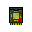
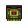

[⬅️ Retour à l'index des mods](../README.md)

---

## Circuit Adaptive
**ID Technique** : `viescraftmachines:circuit_adaptive` | **Machine** : `minecraft:crafting_shaped`

| Emplacement | Ingrédient | Icône |
| :--- | :--- | :--- |
| # | Circuit Logic |  |
| F | Kit Framework |  |

---
## Circuit Logic
**ID Technique** : `viescraftmachines:circuit_logic` | **Machine** : `minecraft:crafting_shaped`

| Emplacement | Ingrédient | Icône |
| :--- | :--- | :--- |
| # | Machine Parts |  |
| R | Redstone |  |
| G | Gold Nugget |  |

---
## Fuel Machine Battery
**ID Technique** : `viescraftmachines:fuel_machine_battery` | **Machine** : `minecraft:crafting_shaped`

| Emplacement | Ingrédient | Icône |
| :--- | :--- | :--- |
| X | Xegonite Shard |  |
| # | Fuel Machine Pellet |  |
| F | Kit Framework |  |
| I | Iron Ingot |  |
| L | Circuit Logic |  |

---
## Fuel Machine Pellet
**ID Technique** : `viescraftmachines:fuel_machine_pellet` | **Machine** : `minecraft:crafting_shaped`

| Emplacement | Ingrédient | Icône |
| :--- | :--- | :--- |
| X | Xegonite Shard |  |
| # | Coals |  |

---
## Instruction Circuit Flying
**ID Technique** : `viescraftmachines:instruction_circuit_flying` | **Machine** : `minecraft:crafting_shaped`

| Emplacement | Ingrédient | Icône |
| :--- | :--- | :--- |
| A | Circuit Adaptive |  |
| # | Kit Framework |  |
| P | Glass Pane |  |
| R | Redstone |  |
| B | Book |  |

---
## Instruction Circuit Ground
**ID Technique** : `viescraftmachines:instruction_circuit_ground` | **Machine** : `minecraft:crafting_shaped`

| Emplacement | Ingrédient | Icône |
| :--- | :--- | :--- |
| A | Circuit Adaptive |  |
| # | Kit Framework |  |
| P | Glass Pane |  |
| R | Redstone |  |
| B | Book |  |

---
## Instruction Circuit Hauler
**ID Technique** : `viescraftmachines:instruction_circuit_hauler` | **Machine** : `minecraft:crafting_shaped`

| Emplacement | Ingrédient | Icône |
| :--- | :--- | :--- |
| A | Circuit Adaptive |  |
| # | Kit Framework |  |
| P | Glass Pane |  |
| R | Redstone |  |
| B | Book |  |

---
## Instruction Circuit Sea
**ID Technique** : `viescraftmachines:instruction_circuit_sea` | **Machine** : `minecraft:crafting_shaped`

| Emplacement | Ingrédient | Icône |
| :--- | :--- | :--- |
| A | Circuit Adaptive |  |
| # | Kit Framework |  |
| P | Glass Pane |  |
| R | Redstone |  |
| B | Book |  |

---
## Kit Construction Cloth
**ID Technique** : `viescraftmachines:kit_construction_cloth` | **Machine** : `minecraft:crafting_shaped`

| Emplacement | Ingrédient | Icône |
| :--- | :--- | :--- |
| F | Kit Framework |  |
| C | Circuit Logic |  |
| # | Wool |  |

---
## Kit Construction Metal
**ID Technique** : `viescraftmachines:kit_construction_metal` | **Machine** : `minecraft:crafting_shaped`

| Emplacement | Ingrédient | Icône |
| :--- | :--- | :--- |
| F | Kit Framework |  |
| C | Circuit Logic |  |
| # | Iron Ingot |  |

---
## Kit Construction Panel
**ID Technique** : `viescraftmachines:kit_construction_panel` | **Machine** : `minecraft:crafting_shaped`

| Emplacement | Ingrédient | Icône |
| :--- | :--- | :--- |
| F | Kit Framework |  |
| C | Circuit Logic |  |
| # | Planks |  |

---
## Kit Detailing Cloth
**ID Technique** : `viescraftmachines:kit_detailing_cloth` | **Machine** : `minecraft:crafting_shaped`

| Emplacement | Ingrédient | Icône |
| :--- | :--- | :--- |
| # | Circuit Adaptive |  |
| F | Kit Framework |  |
| B | Book |  |

---
## Kit Detailing Frame
**ID Technique** : `viescraftmachines:kit_detailing_frame` | **Machine** : `minecraft:crafting_shaped`

| Emplacement | Ingrédient | Icône |
| :--- | :--- | :--- |
| # | Circuit Adaptive |  |
| F | Kit Framework |  |
| B | Book |  |

---
## Kit Detailing Metal
**ID Technique** : `viescraftmachines:kit_detailing_metal` | **Machine** : `minecraft:crafting_shaped`

| Emplacement | Ingrédient | Icône |
| :--- | :--- | :--- |
| # | Circuit Adaptive |  |
| F | Kit Framework |  |
| B | Book |  |

---
## Kit Detailing Panel
**ID Technique** : `viescraftmachines:kit_detailing_panel` | **Machine** : `minecraft:crafting_shaped`

| Emplacement | Ingrédient | Icône |
| :--- | :--- | :--- |
| # | Circuit Adaptive |  |
| F | Kit Framework |  |
| B | Book |  |

---
## Kit Framework
**ID Technique** : `viescraftmachines:kit_framework` | **Machine** : `minecraft:crafting_shaped`

| Emplacement | Ingrédient | Icône |
| :--- | :--- | :--- |
| F | Machine Parts |  |

---
## Kit Service Durability Large
**ID Technique** : `viescraftmachines:kit_service_durability_large` | **Machine** : `minecraft:crafting_shaped`

| Emplacement | Ingrédient | Icône |
| :--- | :--- | :--- |
| R | Redstone |  |
| # | Kit Framework |  |
| B | Book |  |

---
## Kit Service Durability Small
**ID Technique** : `viescraftmachines:kit_service_durability_small` | **Machine** : `minecraft:crafting_shaped`

| Emplacement | Ingrédient | Icône |
| :--- | :--- | :--- |
| R | Redstone |  |
| # | Kit Framework |  |
| B | Paper |  |

---
## Kit Service Energy Large
**ID Technique** : `viescraftmachines:kit_service_energy_large` | **Machine** : `minecraft:crafting_shaped`

| Emplacement | Ingrédient | Icône |
| :--- | :--- | :--- |
| R | Redstone |  |
| # | Kit Framework |  |
| B | Book |  |

---
## Kit Service Energy Small
**ID Technique** : `viescraftmachines:kit_service_energy_small` | **Machine** : `minecraft:crafting_shaped`

| Emplacement | Ingrédient | Icône |
| :--- | :--- | :--- |
| R | Redstone |  |
| # | Kit Framework |  |
| B | Paper |  |

---
## Machine Chassis Basic
**ID Technique** : `viescraftmachines:machine_chassis_basic` | **Machine** : `minecraft:crafting_shaped`

| Emplacement | Ingrédient | Icône |
| :--- | :--- | :--- |
| # | Minecart |  |
| F | Machine Parts |  |
| C | Circuit Logic |  |

---
## Machine Parts Mold
**ID Technique** : `viescraftmachines:machine_parts_mold` | **Machine** : `minecraft:crafting_shaped`

| Emplacement | Ingrédient | Icône |
| :--- | :--- | :--- |
| X | Xegonite Shard |  |
| # | Coals |  |
| C | Clay Ball |  |
| M | Planks |  |

---
## Machine Upgrade Greater
**ID Technique** : `viescraftmachines:machine_upgrade_greater` | **Machine** : `minecraft:crafting_shaped`

| Emplacement | Ingrédient | Icône |
| :--- | :--- | :--- |
| K | Kit Framework |  |
| A | Circuit Adaptive |  |
| N | Netherite Ingot |  |
| # | Machine Upgrade Lesser |  |

---
## Machine Upgrade Lesser
**ID Technique** : `viescraftmachines:machine_upgrade_lesser` | **Machine** : `minecraft:crafting_shaped`

| Emplacement | Ingrédient | Icône |
| :--- | :--- | :--- |
| K | Kit Framework |  |
| A | Circuit Adaptive |  |
| N | Heart Of The Sea |  |
| # | Machine Upgrade Minor |  |

---
## Machine Upgrade Masterwork
**ID Technique** : `viescraftmachines:machine_upgrade_masterwork` | **Machine** : `minecraft:crafting_shaped`

| Emplacement | Ingrédient | Icône |
| :--- | :--- | :--- |
| K | Kit Framework |  |
| A | Circuit Adaptive |  |
| N | Nether Star |  |
| # | Machine Upgrade Greater |  |

---
## Machine Upgrade Minor
**ID Technique** : `viescraftmachines:machine_upgrade_minor` | **Machine** : `minecraft:crafting_shaped`

| Emplacement | Ingrédient | Icône |
| :--- | :--- | :--- |
| K | Kit Framework |  |
| A | Circuit Adaptive |  |
| D | Diamond |  |
| E | Ender Eye |  |

---
## Machine Workbench
**ID Technique** : `viescraftmachines:machine_workbench` | **Machine** : `minecraft:crafting_shaped`

| Emplacement | Ingrédient | Icône |
| :--- | :--- | :--- |
| # | Machine Parts |  |
| C | Crafting Table |  |

---
## Music Disc Bramble
**ID Technique** : `viescraftmachines:music_disc_bramble` | **Machine** : `minecraft:crafting_shaped`

| Emplacement | Ingrédient | Icône |
| :--- | :--- | :--- |
| # | Xegonite Shard |  |
| B | Book |  |

---
## Music Disc Castle
**ID Technique** : `viescraftmachines:music_disc_castle` | **Machine** : `minecraft:crafting_shaped`

| Emplacement | Ingrédient | Icône |
| :--- | :--- | :--- |
| # | Xegonite Shard |  |
| B | Book |  |

---
## Music Disc Dire
**ID Technique** : `viescraftmachines:music_disc_dire` | **Machine** : `minecraft:crafting_shaped`

| Emplacement | Ingrédient | Icône |
| :--- | :--- | :--- |
| # | Xegonite Shard |  |
| B | Book |  |

---
## Music Disc Jungle
**ID Technique** : `viescraftmachines:music_disc_jungle` | **Machine** : `minecraft:crafting_shaped`

| Emplacement | Ingrédient | Icône |
| :--- | :--- | :--- |
| # | Xegonite Shard |  |
| B | Book |  |

---
## Music Disc Storms
**ID Technique** : `viescraftmachines:music_disc_storms` | **Machine** : `minecraft:crafting_shaped`

| Emplacement | Ingrédient | Icône |
| :--- | :--- | :--- |
| # | Xegonite Shard |  |
| B | Book |  |

---
## Music Disc Timescar
**ID Technique** : `viescraftmachines:music_disc_timescar` | **Machine** : `minecraft:crafting_shaped`

| Emplacement | Ingrédient | Icône |
| :--- | :--- | :--- |
| # | Xegonite Shard |  |
| B | Book |  |

---
## Machine Parts
**ID Technique** : `viescraftmachines:machine_parts` | **Machine** : `minecraft:smelting`

| Emplacement | Ingrédient | Icône |
| :--- | :--- | :--- |
| item | Machine Parts Mold |  |

---
## Tool Dismounter
**ID Technique** : `viescraftmachines:tool_dismounter` | **Machine** : `minecraft:crafting_shaped`

| Emplacement | Ingrédient | Icône |
| :--- | :--- | :--- |
| # | Feather |  |
| F | Machine Parts |  |
| L | Leather |  |

---
## Tool Ignition Key
**ID Technique** : `viescraftmachines:tool_ignition_key` | **Machine** : `minecraft:crafting_shaped`

| Emplacement | Ingrédient | Icône |
| :--- | :--- | :--- |
| # | Circuit Logic |  |
| F | Machine Parts |  |
| R | Redstone |  |

---
## Tool Machine Deed
**ID Technique** : `viescraftmachines:tool_machine_deed` | **Machine** : `minecraft:crafting_shaped`

| Emplacement | Ingrédient | Icône |
| :--- | :--- | :--- |
| # | Circuit Logic |  |
| F | Machine Parts |  |
| P | Paper |  |
| R | Redstone |  |

---
## Tool Machine Wrench
**ID Technique** : `viescraftmachines:tool_machine_wrench` | **Machine** : `minecraft:crafting_shaped`

| Emplacement | Ingrédient | Icône |
| :--- | :--- | :--- |
| F | Machine Parts |  |
| L | Leather |  |

---
## Xegonite Block
**ID Technique** : `viescraftmachines:xegonite_block` | **Machine** : `minecraft:crafting_shaped`

| Emplacement | Ingrédient | Icône |
| :--- | :--- | :--- |
| # | Machine Parts |  |

---
## Machine Parts
**ID Technique** : `viescraftmachines:machine_parts` | **Machine** : `minecraft:crafting_shapeless`

| Emplacement | Ingrédient | Icône |
| :--- | :--- | :--- |
| - | Xegonite Block |  |

---
